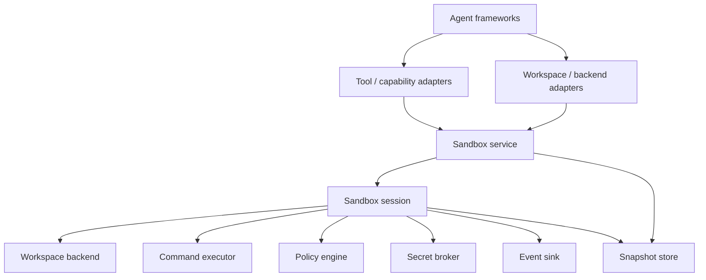

# Python Agent Sandbox Integration Research

**Research date:** 2026-08-28

**Question:** Where should a stateful, in-memory virtual filesystem and constrained shell
integrate with the Python server-side agent ecosystem?

## Executive decision

The Python project should not make an agent framework its architectural center.

The recommended design is:

1. A framework-neutral Python core owns virtual workspace state, commands, snapshots,
   policy, secrets, and telemetry.
2. A typed, async Python service interface is the canonical integration boundary.
3. The current design supports two native integration levels:
   - tool/capability adapters
   - workspace/backend adapters
4. Initial adapters target frameworks that expose useful examples of those seams:
   - PydanticAI `Capability`
   - LangChain Deep Agents backend protocol
   - OpenAI Agents SDK sandbox client/session, initially marked experimental because
     Sandbox Agents are beta
5. Other frameworks use a very small function-tool or capability wrapper when needed.
6. Real process, container, VM, or WASM execution is a separate pluggable backend. The
   in-memory implementation must not claim OS-level isolation.
7. MCP is retained as a possible future interoperability adapter but is not part of the
   current design or implementation phase.

Across the Python ecosystem there are two useful extension patterns, but **not every
framework provides both**:

- **Tool/capability level:** ordinary typed functions are exposed to the model. A
  capability may package those tools with instructions, hooks, dependencies, and cleanup,
  but the framework does not automatically treat the implementation as its filesystem or
  execution host.
- **Workspace/backend level:** the framework's built-in file, shell, artifact, and
  lifecycle behavior delegates to a replaceable backend/session interface.

All major frameworks support the first pattern. Only some provide the second.

Also, "the agent runs inside the workspace" is convenient shorthand but is not literally
true for an in-memory backend. The model runs at its provider, and the agent loop normally
runs in the application process. A workspace backend redirects the agent's **file and
command operations** into the virtual workspace. Running the entire agent process inside
an isolated environment instead requires a process, container, VM, or WASM deployment
boundary.

### Which of the three major SDKs exposes a real workspace backend?

| SDK | Tool/capability integration | Replaceable workspace/backend integration | Practical meaning |
|---|---|---|---|
| LangChain/LangGraph | Yes, through ordinary tools | **Not in generic LangChain/LangGraph. Yes in the separate Deep Agents package** through `BackendProtocol` and `SandboxBackendProtocol` | Implementing the Deep Agents protocol lets its built-in file tools, and optionally `execute`, operate on the in-memory workspace |
| PydanticAI | **Yes**, through tools, toolsets, dependencies, and `Capability` | **No general workspace-host protocol** equivalent to Deep Agents or OpenAI Sandbox Agents | Implement a custom Capability/Toolset whose functions delegate to `SandboxSession`; PydanticAI still sees a capability containing tools rather than a mounted filesystem backend |
| OpenAI Agents SDK | Yes, through function tools and MCP | **Yes for `SandboxAgent`**, through `BaseSandboxClient` and `BaseSandboxSession` | A custom client/session can participate in manifest materialization, live session lifecycle, resume, and snapshots; this surface is currently beta |

Therefore, the new project should support both integration patterns without assuming they
are universally available:

- use a small tool/capability adapter everywhere
- implement a native workspace backend where a framework has a stable, valuable contract
- keep the Python core independent from both patterns

Relevant public contracts:

- [Deep Agents backend protocol](https://github.com/langchain-ai/deepagents/blob/main/libs/deepagents/deepagents/backends/protocol.py)
- [OpenAI Agents SDK base sandbox client](https://github.com/openai/openai-agents-python/blob/main/src/agents/sandbox/session/sandbox_client.py)
- [PydanticAI capability model](https://pydantic.dev/docs/ai/capabilities/overview/)

## Decision summary

| Decision | Recommendation | Reason |
|---|---|---|
| Core dependency direction | Agent frameworks depend on adapters; core depends on none | Prevents framework churn from changing domain behavior |
| Canonical in-process API | Typed Python protocols and domain result models | Fast, testable, and easy to wrap |
| Current integration levels | Tool/capability and workspace/backend adapters | Covers universal function tools and deeper framework-native workspace contracts |
| External protocol | None in the current phase; reconsider MCP later | Prove the native boundaries before adding protocol and transport concerns |
| First native adapter | PydanticAI Capability | Pythonic composition, typed boundaries, hooks, and close conceptual fit |
| Second native adapter | LangChain Deep Agents backend | Direct in-memory filesystem precedent and explicit backend protocol |
| OpenAI integration | Experimental native sandbox client/session adapter | Excellent conceptual fit, but Sandbox Agents are still beta |
| Microsoft/Google/AWS integrations | Focused function-tool or capability examples first | Their native function-tool APIs are simple; a dedicated package adds little initially |
| A2A | Do not use for the core sandbox API | It is an agent-to-agent task protocol, not a tool/workspace protocol |
| Security positioning | Logical workspace and policy boundary only | Same-process memory is not an isolation boundary |
| Future execution | Plug in process/container/VM/WASM executors | Keeps the workspace model stable while isolation level changes |

## 1. Starting point: what should carry forward

The .NET project established a useful product model:

- One sandbox instance belongs to one agent/session lane.
- Four primary agent operations:
  - execute a constrained shell command
  - read a file by line range
  - write a complete file
  - apply a patch
- Snapshots transfer state across sessions.
- Capabilities extend behavior without putting infrastructure dependencies in core.
- Resource limits, secret policy, and telemetry are first-class.
- The filesystem is virtual and in memory rather than a projection of the host disk.

Those ideas remain relevant. The Python version should preserve them while changing the
integration shape.

### Preserve

- Small, predictable agent-facing tool surface.
- Per-session ownership and deterministic mutation ordering.
- Structured results instead of prose-only tool output.
- Snapshot and restore as explicit state transitions.
- Interface-owned dependencies for storage, execution, policy, secrets, and events.
- No direct dependency from domain behavior to a specific agent framework.

### Change

- Make agent adapters separate optional packages or extras.
- Use async service boundaries even if the first in-memory implementation completes
  synchronously; future remote executors will be asynchronous.
- Separate virtual workspace operations from command execution.
- Treat model-visible tools and host-only lifecycle operations differently.
- Prove tool/capability and workspace/backend adapters before adding an external protocol.
- Make the security tier explicit in types, configuration, and documentation.

## 2. How the Python agent landscape is organized

The ecosystem is easier to reason about when divided into layers.

### Agent-loop SDKs

These provide an agent loop, tools, model connectors, sessions, and hooks while leaving
deployment primarily to the application:

- [OpenAI Agents SDK](https://github.com/openai/openai-agents-python)
- [PydanticAI](https://github.com/pydantic/pydantic-ai)
- [Strands Agents](https://github.com/strands-agents/harness-sdk)
- [Hugging Face smolagents](https://github.com/huggingface/smolagents)

### Stateful workflow and orchestration frameworks

These add graphs, durable state, multi-agent routing, or workflow semantics:

- [LangGraph](https://github.com/langchain-ai/langgraph) and
  [Deep Agents](https://github.com/langchain-ai/deepagents)
- [Microsoft Agent Framework](https://github.com/microsoft/agent-framework)
- [Google Agent Development Kit](https://github.com/google/adk-python)
- [LlamaIndex](https://github.com/run-llama/llama_index)

### Opinionated agent platforms and pipeline frameworks

These provide higher-level role, pipeline, deployment, or operations models:

- [CrewAI](https://github.com/crewAIInc/crewAI)
- [Haystack](https://github.com/deepset-ai/haystack)
- [Agno](https://github.com/agno-agi/agno)

These categories overlap. The distinction is useful because the more opinionated the
framework, the less value there is in making it a dependency of a reusable sandbox core.

## 3. Framework comparison

Versions are intentionally omitted from this table. The projects release rapidly, while
the integration concepts are more durable than a point-in-time package number.

| Framework | Natural integration seam | State/lifecycle fit | MCP | Fit for this project | Initial treatment |
|---|---|---|---|---|---|
| OpenAI Agents SDK | Function tools for `Agent`; client/session backend for `SandboxAgent` | Very strong: live sessions, manifests, saved state, and snapshots | Native local and hosted MCP | A true backend seam, but its API is beta | Experimental first-class adapter |
| PydanticAI | `Capability`, toolset, and typed run dependencies; no generic workspace backend | Strong capability lifecycle, but the adapter still supplies ordinary tools | Native capability/toolset | Excellent Python-native tool/capability seam | First-class capability adapter |
| LangChain Deep Agents | `BackendProtocol` providing file tools and `SandboxBackendProtocol` adding `execute` | Very strong: `StateBackend`, stores, checkpointers, and sandbox backends | Available through LangChain adapters | Closest direct in-memory backend precedent | First-class backend adapter |
| Microsoft Agent Framework | Function tools, middleware, local/hosted shell, MCP | Strong sessions and workflow checkpointing | Native | Good enterprise and Microsoft ecosystem reach | Function-tool example first |
| Google ADK | Function tools, tool context, workflows, plugins, MCP | Strong session and graph workflow model | Native | Good for Google/Vertex users | Function-tool example first |
| Strands Agents | Python tools, hooks, sessions, MCP `ToolProvider` | Good, with a deliberately small in-process SDK | Native | Clean adapter surface, especially for AWS users | Function-tool example first |
| LlamaIndex | `FunctionTool`, `ToolSpec`, workflow context | Good for retrieval-heavy workflows | Integration package | Useful, but less workspace-specific | Example first |
| CrewAI | `BaseTool`, `@tool`, or agent `mcps` configuration | Flow state is useful; role/task model is opinionated | Native client integration | Tool wrapping is easy; deeper coupling is not attractive | Function-tool example |
| Haystack | `Tool`, agent hooks, pipeline components, MCP integration | Strong hooks; pipeline state is framework-specific | Integration package and Hayhooks | Best for existing Haystack users | Function-tool example |
| Agno | Python callables, toolkit, `MCPTools`, AgentOS | Strong hosted/session story in AgentOS | Native | Its callable/toolkit seam is sufficient initially | Function-tool example |
| smolagents | `Tool`, `@tool`, MCP collection | Minimal state and lifecycle; local code executor is not secure isolation | Native client integration | Useful for demonstrations and experiments | Example only |

### 3.1 OpenAI Agents SDK

The OpenAI Agents SDK now has a direct workspace model:

- `SandboxAgent` remains a normal Agent but adds a manifest, capabilities, and sandbox
  run configuration.
- A manifest describes the fresh workspace.
- A sandbox session owns live files and command execution.
- saved session state and snapshots support later runs.
- local, Docker, and hosted sandbox clients can be selected without changing the agent
  definition.

This is almost the same conceptual split the Python project should adopt. It is strong
evidence that the correct abstraction is a **sandbox client/session backend**, not only a
bag of function tools.

However, OpenAI marks Sandbox Agents as beta. Do not let its current protocol shape leak
into core. Implement it behind an experimental adapter after the core contract has been
validated independently.

The exact provider extension surface is a `BaseSandboxClient` that creates or resumes an
instrumented `SandboxSession` around a custom `BaseSandboxSession`. The session ABC has
six required methods: internal command execution, read, write, running-state detection,
workspace persistence, and workspace hydration. This abstract minimum is misleading for
a non-POSIX backend because several inherited features invoke Unix commands. The in-memory
adapter should also override native filesystem and path-validation operations rather than
emulating an entire host merely to satisfy SDK internals.

See [OpenAI `SandboxAgent` Backend Contract](./OPENAI_SANDBOX_AGENT_ADAPTER.md) for the
version-pinned signatures, implementation skeleton, lifecycle behavior, POSIX assumptions,
snapshot contract, and `Runner` wiring.

Sources:

- [Sandbox Agents quickstart](https://openai.github.io/openai-agents-python/sandbox_agents/)
- [Sandbox concepts](https://openai.github.io/openai-agents-python/sandbox/guide/)
- [Sandbox clients](https://openai.github.io/openai-agents-python/sandbox/clients/)
- [MCP integration](https://openai.github.io/openai-agents-python/mcp/)

### 3.2 PydanticAI and Pydantic AI Harness

PydanticAI v2 makes `Capability` its primary extension unit. A capability can contain:

- tools
- lifecycle hooks
- instructions
- model settings
- model selection behavior

The first-party Pydantic AI Harness already includes:

- a path-contained `FileSystem` capability with read, write, edit, list, search, find,
  create, and metadata tools
- a `Shell` capability with command controls, timeouts, background process management,
  output limits, environment filtering, and cleanup
- a Modal-backed isolated execution capability

This is both a design reference and direct competition. A new project should not copy the
same host-filesystem wrapper. Its differentiation should be:

- entirely in-memory state by default
- deterministic simulated shell rather than host subprocesses
- snapshot-first session transfer
- framework-neutral core
- explicit policy, secret brokering, and event contracts
- optional executor backends with clearly named isolation levels

The PydanticAI native adapter should implement a capability that binds a sandbox session
to tools and lifecycle cleanup. The in-memory session should be injected by the host, not
looked up through global state.

Sources:

- [PydanticAI v2 capability model](https://pydantic.dev/articles/pydantic-ai-v2)
- [Capabilities overview](https://pydantic.dev/docs/ai/capabilities/overview/)
- [Harness FileSystem](https://pydantic.dev/docs/ai/harness/filesystem/)
- [Harness Shell](https://pydantic.dev/docs/ai/harness/shell/)
- [PydanticAI MCP capability](https://pydantic.dev/docs/ai/capabilities/mcp/)

### 3.3 LangChain Deep Agents

Deep Agents provides the closest existing precedent:

- `StateBackend` stores files in LangGraph state and persists them across turns when a
  checkpointer is used.
- `FilesystemBackend` operates on host files.
- `LocalShellBackend` adds unrestricted host shell execution and explicitly warns that it
  is not isolated.
- sandbox backends provide file operations and an `execute` operation against external
  isolated environments.
- a backend protocol allows custom implementations.

The new in-memory project can implement the Deep Agents backend protocol without making
LangGraph part of core. That adapter gives existing LangChain users native filesystem
behavior, while the same core can serve other frameworks.

Deep Agents is also evidence that files are useful as agent state, not merely as a way to
run code. Large tool results can be offloaded into files and read back in pieces, reducing
context pressure.

Sources:

- [Deep Agents backends](https://docs.langchain.com/oss/python/deepagents/backends)
- [Deep Agents sandboxes](https://docs.langchain.com/oss/python/deepagents/sandboxes)
- [Deep Agents threat model](https://github.com/langchain-ai/deepagents/blob/main/libs/deepagents/THREAT_MODEL.md)

### 3.4 Microsoft Agent Framework

Microsoft Agent Framework is the unified direction for patterns from Semantic Kernel and
AutoGen. It provides:

- typed function tools
- middleware around agent and tool execution
- sessions and graph workflows
- checkpointing and hydration
- local and hosted shell patterns
- MCP integration
- approval flows and OpenTelemetry-oriented operations

For a developer coming from the .NET project, it remains an important ecosystem target.
The Python sandbox should integrate through ordinary typed tools first. A dedicated
workspace/backend adapter is justified only if Agent Framework exposes a stable contract
that provides more value than its tool seam.

Sources:

- [Microsoft Agent Framework 1.0](https://devblogs.microsoft.com/agent-framework/microsoft-agent-framework-version-1-0/)
- [Agent tools](https://learn.microsoft.com/en-us/agent-framework/agents/tools/)
- [Agent harness patterns](https://devblogs.microsoft.com/agent-framework/agent-harness-in-agent-framework/)

### 3.5 Google ADK

Google ADK 2.0 combines:

- code-first agents and function tools
- graph workflows
- state management, routing, retry, and human-in-the-loop behavior
- MCP and OpenAPI tools
- Cloud Run and Vertex AI Agent Engine deployment paths

The four native function wrappers are sufficient initially. A deeper adapter would mostly
translate ADK session context into the sandbox registry and would not improve the core
design.

Source: [Google ADK Python](https://github.com/google/adk-python)

### 3.6 Strands Agents

Strands is a relatively low-level, in-process agent SDK with:

- Python tools
- lifecycle controls and hooks
- sessions and memory
- streaming and cancellation
- MCP clients as managed tool providers
- built-in tracing and guardrails

This is a good demonstration target because a small wrapper can show the library working
without a large orchestration stack. Its ordinary tool seam means a dedicated
distribution is not required at the start.

Sources:

- [Strands Agents SDK](https://github.com/strands-agents/harness-sdk)
- [Strands MCP tools](https://strandsagents.com/docs/user-guide/concepts/tools/mcp-tools/)

### 3.7 Remaining frameworks

LlamaIndex, CrewAI, Haystack, Agno, and smolagents all support ordinary Python tools.
Their deeper abstractions are useful for their target workloads, but none should shape
the core sandbox:

- LlamaIndex is strongest when the agent is already organized around retrieval and
  workflow context.
- CrewAI is organized around roles, tasks, crews, and flows.
- Haystack is organized around tools, hooks, components, and pipelines.
- Agno becomes most opinionated when AgentOS is adopted.
- smolagents is intentionally small and is useful for experimentation, but its local
  Python executor explicitly does not provide robust security isolation.

Sources:

- [LlamaIndex tools](https://developers.llamaindex.ai/python/framework/module_guides/deploying/agents/tools/)
- [CrewAI custom tools](https://docs.crewai.com/en/learn/create-custom-tools)
- [CrewAI MCP](https://docs.crewai.com/en/mcp/overview)
- [Haystack hooks](https://docs.haystack.deepset.ai/docs/hooks)
- [Haystack MCP integration](https://haystack.deepset.ai/integrations/mcp)
- [Agno MCP](https://docs.agno.com/tools/mcp/overview)
- [smolagents secure code execution](https://huggingface.co/docs/smolagents/tutorials/secure_code_execution)

## 4. Recommended architecture

The approved design is decomposed into the
[High-Level Design](./HIGH_LEVEL_DESIGN.md), the
[core component designs](./components/README.md), and the
[integration designs](./integrations/README.md).



### 4.1 Core package

The core package should contain no imports from OpenAI, LangChain, PydanticAI, Microsoft,
Google, AWS, CrewAI, or MCP.

Suggested responsibilities:

```text
src/
  <package>/
    core/
      models.py
      errors.py
      service.py
      session.py
    workspace/
      models.py
      reader.py
      mutator.py
      memory.py
      paths.py
      snapshot_codec.py
    commands/
      models.py
      executor.py
      dispatcher.py
      parser.py
      builtins/
    policy/
      models.py
      engine.py
      limits.py
    secrets/
      models.py
      broker.py
    events/
      models.py
      sink.py
    snapshots/
      models.py
      store.py
      memory.py
```

Interfaces are defined beside the consuming component rather than in a global protocol
bucket. Optional framework integrations live outside core:

```text
adapters/
  tool_capability/
    pydantic_ai/
    microsoft_agent_framework/
  workspace_backend/
    deepagents/
    openai_agents/
```

These can begin as package extras and become separate distributions only if dependency
resolution or release cadence requires it.

MCP is a deferred future adapter and should not have an implementation package in the
current phase.

### 4.2 Internal interfaces

Do not create one broad infrastructure interface. Use narrow ports owned by the sandbox
module:

```python
from collections.abc import AsyncIterator
from typing import Protocol


class WorkspaceBackend(Protocol):
    async def read_file(self, request: ReadFileRequest) -> ReadFileResult: ...
    async def write_file(self, request: WriteFileRequest) -> FileMutationResult: ...
    async def apply_patch(self, request: ApplyPatchRequest) -> FileMutationResult: ...


class CommandExecutor(Protocol):
    async def execute(self, request: ExecuteRequest) -> ExecuteResult: ...


class SnapshotStore(Protocol):
    async def save(self, snapshot: SandboxSnapshot) -> SnapshotRef: ...
    async def load(self, snapshot_id: str) -> SandboxSnapshot: ...


class SecretBroker(Protocol):
    async def resolve(self, request: SecretAccessRequest) -> SecretLease: ...


class SandboxEventSink(Protocol):
    async def emit(self, event: SandboxEvent) -> None: ...
```

`SandboxSession` is the application-facing facade that composes these collaborators. Its
interface may contain the small set of operations an agent needs, while its constructor
depends only on the narrow ports above.

### 4.3 Sync internals, async boundary

An in-memory tree can use synchronous implementation methods internally. The public
session/service boundary should still be async because:

- every major server-side framework has an async path
- secret resolution and snapshot persistence may become remote
- future Docker, E2B, Daytona, Modal, or WASM executors are asynchronous
- cancellation and timeouts need a common contract

Do not fake parallelism with unnecessary threads. An async method may complete immediately
for the in-memory backend.

### 4.4 Session ownership

Keep the original single-owner idea:

- One sandbox session is one logical mutation lane.
- The host creates and disposes the session.
- An agent adapter receives the session through constructor or run dependency injection.
- The model should not normally create, select, or destroy arbitrary sessions.
- Start with serialized mutations for deterministic behavior.
- Add concurrent reads only after the invariants are tested.

For a remote service, use opaque sandbox handles. Every operation must verify that the
authenticated caller owns the handle.

## 5. Agent-facing tool design

### 5.1 Keep the default model-visible surface small

Recommended default tools:

| Tool | Purpose |
|---|---|
| `execute` | Run a command through the configured command executor |
| `read_file` | Read a bounded line range with metadata |
| `write_file` | Atomically create or replace a text file |
| `apply_patch` | Apply a context-aware patch |

Useful optional tools:

- `list_files`
- `file_info`
- `get_skill`

Host-controlled operations by default:

- create/dispose sandbox
- take/restore snapshot
- configure policy
- register capabilities
- grant secret access

Snapshots can be exposed to the model for explicit checkpoint workflows, but that should
be an opt-in capability rather than part of the universal four-tool surface.

### 5.2 Return domain models

Avoid returning ambiguous strings. Suggested result fields:

```text
ExecuteResult
  exit_code
  stdout
  stderr
  duration_ms
  output_truncated

ReadFileResult
  path
  content
  start_line
  end_line
  total_lines
  content_hash

FileMutationResult
  path
  created
  previous_hash
  current_hash
  bytes_written
```

Stable errors should distinguish:

- invalid path
- path outside workspace
- file not found
- stale content hash
- invalid patch
- quota exceeded
- command not supported
- command timeout
- policy denied
- secret denied
- sandbox not found or expired

Adapters translate these domain errors into each framework's retryable tool error shape.
The core should not know about `ModelRetry`, LangChain exceptions, MCP content blocks, or
provider-specific error messages.

### 5.3 Add optimistic concurrency

The Python ecosystem references include hash-guarded writes and edits. Add an optional
`expected_hash` to mutations. This prevents an agent from silently overwriting content
that changed after its last read and is valuable even in a single-agent lane when tools
or host code can also modify state.

## 6. Future MCP consideration

This section is retained as ecosystem research only. MCP is not part of the approved
current architecture, implementation roadmap, or acceptance criteria. Reconsider it
after tool/capability and workspace/backend adapters prove that the core contracts are
stable.

### 6.1 Possible future role

If adopted later, MCP should be an **external** adapter, not the internal domain API.

This distinction provides:

- no protocol overhead for in-process callers
- broad compatibility for external callers
- one domain implementation underneath native and protocol adapters
- freedom to evolve internal models without coupling them to JSON-RPC

### 6.2 Implications if MCP is adopted

The current MCP base specification is stateless. A connection or stdio process is not a
conversation/session boundary. State spanning requests must be referenced by an explicit
identifier.

Therefore:

- every multiplexed request needs an opaque sandbox handle, or
- authorization context must bind the call to exactly one sandbox and the adapter must
  still carry an explicit application-level handle internally
- never infer sandbox identity from the current TCP connection, SSE stream, or stdio
  process
- never trust a model-provided tenant identifier without checking authorization

Source: [MCP base protocol, statelessness](https://modelcontextprotocol.io/specification/2026-07-28/basic)

### 6.3 MCP mapping

| Sandbox concept | MCP mapping |
|---|---|
| Execute, write, patch | Tool |
| Model-initiated ranged read | Tool |
| Host-selected file context | Resource |
| File address | `memsandbox://<sandbox-handle>/<path>` URI |
| File-change notification | Resource subscription |
| Snapshot/restore | Optional application tools |
| Long operation progress | MCP progress notifications |
| Cancellation | Transport-specific MCP cancellation |
| Domain error | Tool error content or structured application error |

`read_file` can be both:

- a tool when the model autonomously decides what to inspect
- a resource when the host or user selects files to add to context

Sources:

- [MCP tools](https://modelcontextprotocol.io/specification/2026-07-28/server/tools)
- [MCP resources](https://modelcontextprotocol.io/specification/2026-07-28/server/resources)

### 6.4 Transport choices

| Deployment | Recommended transport | Notes |
|---|---|---|
| Embedded in the same Python process | Native adapter, not MCP | Lowest overhead and simplest lifecycle |
| Local desktop/CLI integration | MCP stdio | Good interoperability; still pass explicit state handles |
| Remote single- or multi-tenant service | MCP Streamable HTTP | Requires authentication, authorization, quotas, and ownership checks |
| Non-agent clients and admin operations | Optional OpenAPI/HTTP API | Useful for lifecycle, health, and operations tooling |

MCP authorization is optional at the protocol level. If remote HTTP authorization is
implemented, follow the MCP OAuth profile and Protected Resource Metadata requirements.
For stdio, credentials should come from the launching environment rather than the HTTP
authorization flow.

Sources:

- [MCP transports](https://modelcontextprotocol.io/specification/2026-07-28/basic/transports)
- [MCP authorization](https://modelcontextprotocol.io/specification/2026-07-28/basic/authorization)

### 6.5 MCP is not a security mechanism

MCP standardizes discovery and invocation. It does not isolate execution, validate the
business meaning of a command, or prevent data exfiltration. Approval, authorization,
policy, output redaction, and runtime isolation remain application responsibilities.

## 7. Native adapter strategy

### 7.1 PydanticAI

Create a capability that:

- receives a `SandboxSession` through constructor injection
- contributes the four default tools
- translates domain errors into retryable or terminal PydanticAI errors
- optionally contributes instructions describing shell limits
- uses lifecycle hooks for cleanup and telemetry correlation

Do not reimplement filesystem or shell policy inside the adapter.

### 7.2 LangChain Deep Agents

Implement the Deep Agents backend protocol by delegating to `SandboxSession`.

The adapter should:

- map the Deep Agents file operations to the virtual filesystem
- expose `execute` only when a command executor is enabled
- preserve Deep Agents' expected result formats
- keep LangGraph state/checkpointer concerns outside the core snapshot model

The project snapshot is workspace state. A LangGraph checkpoint is workflow state. They
may reference each other, but they are not interchangeable.

### 7.3 OpenAI Agents SDK

Prototype a sandbox client/session adapter after the first two integrations prove the
core contract.

The adapter should map:

- fresh workspace input to the project's import/source abstraction
- a live OpenAI sandbox session to `SandboxSession`
- saved sandbox session state to an opaque project session reference
- workspace snapshots to the core snapshot model

Keep it experimental until OpenAI's beta sandbox interfaces stabilize.

### 7.4 Other frameworks

For Microsoft Agent Framework, Google ADK, Strands, LlamaIndex, CrewAI, Haystack, Agno,
and smolagents:

1. Publish a short native function-tool or capability example only where it materially
   improves the developer experience.
2. Reuse the common tool/capability adapter behavior and conformance scenario.
3. Add a dedicated package only after a real user needs framework-specific lifecycle or
   state integration.
4. Consider MCP separately in a future interoperability phase.

## 8. A2A and OpenAPI

### 8.1 A2A

[Agent2Agent](https://a2a-protocol.org/latest/specification/) models communication between
independent agents. It includes agent cards, stateful tasks, streaming, artifacts, and
long-running collaboration.

The sandbox is not an autonomous agent. It is a workspace and tool runtime. A2A therefore
adds the wrong abstraction and unnecessary task-management overhead.

Use A2A only if a future product wraps the sandbox in a reasoning agent such as a
"code-execution agent" that accepts high-level delegated tasks. That would be a separate
service above the sandbox, not the sandbox's core API.

### 8.2 OpenAPI

An optional HTTP control plane remains useful for:

- create, inspect, expire, and delete session operations
- snapshot management
- health and readiness
- administrative policy
- non-agent clients

Generate OpenAPI schemas from the same domain boundary models used by native adapters.
Keep model-facing tools and administrative endpoints separate.

## 9. Security and product positioning

### 9.1 The in-memory environment is not OS isolation

An in-memory filesystem and simulated shell can prevent accidental host file mutation
through their own APIs. They cannot isolate arbitrary Python code running in the same
interpreter.

Same-process code may be able to:

- inspect Python objects and memory reachable from the process
- access the real filesystem through `os`, `pathlib`, C extensions, or open descriptors
- make network calls
- read inherited environment variables
- spawn processes
- consume host CPU and memory

Command allowlists and AST rewriting are guardrails, not secure containment. Both
Pydantic AI Harness and smolagents explicitly warn that local command or Python controls
do not replace OS-level isolation.

### 9.2 Recommended terminology

Preferred description:

> A deterministic, stateful virtual workspace for server-side agents, with an in-memory
> filesystem, constrained command model, snapshots, policy, and telemetry.

Required qualification when using the word "sandbox":

> The in-memory backend is a logical sandbox, not an OS security boundary. Use a
> container, VM, or equivalent isolated executor for untrusted code.

### 9.3 Runtime tiers

| Tier | Backend | Intended use | Isolation claim |
|---|---|---|---|
| 0 | In-memory filesystem only | State, artifacts, testing, context offload | No code-execution isolation needed |
| 1 | Simulated shell over virtual APIs | Deterministic agent workspace operations | Logical/API boundary only |
| 2 | Local subprocess adapter | Trusted local automation and development | No multi-tenant security boundary |
| 3 | Container or managed sandbox | Untrusted or autonomous execution | Depends on provider/runtime controls |
| 4 | VM or microVM | Stronger multi-tenant isolation | Hardware virtualization boundary |
| 5 | WASM/WASI | Capability-oriented constrained execution | Runtime-specific isolation and compatibility limits |

Expose the selected tier in configuration and telemetry so deployments cannot silently
mistake a local executor for an isolated one.

## 10. Comparable runtimes and differentiation

| System | What it proves | Difference from the proposed project |
|---|---|---|
| Pydantic AI Harness FileSystem/Shell | Filesystem and shell capabilities are now first-class agent concepts | Uses host filesystem/processes or Modal; framework-specific |
| LangChain Deep Agents StateBackend | In-memory files are useful as thread-scoped agent state | Coupled to LangGraph state and tool conventions |
| OpenAI Sandbox Agents | Sandbox clients, live sessions, manifests, and snapshots are a valuable runtime abstraction | OpenAI SDK-specific and focused on real local/container/hosted workspaces |
| Microsoft Agent Framework harness | Approvals and local/hosted shell fit enterprise agent runtimes | Framework-specific tool/harness layer |
| E2B | Persistent VM-backed execution and pause/resume are valuable | Remote infrastructure and real code execution |
| Daytona | Fast container/VM workspaces and snapshots are valuable | Remote infrastructure rather than pure in-memory state |
| Modal Sandboxes | Pluggable cloud execution and snapshots are valuable | Hosted container execution |
| smolagents LocalPythonExecutor | AST controls reduce accidents but do not create a secure sandbox | Focused on Python code actions, not a virtual workspace |
| RestrictedPython | Restricted language subsets can be useful but are not secure containment | AST rewriting rather than workspace state |
| PyFilesystem2 MemoryFS | Python has a mature filesystem abstraction pattern | No agent tools, shell, snapshots, secrets, or policy model |
| pyfakefs | In-memory filesystem behavior is valuable for tests | Test patching, not an agent runtime |
| Pyodide/WASI | Capability-constrained Python execution is possible | Package/runtime compatibility is more limited |

The clearest product differentiation is:

1. Framework-neutral and embeddable.
2. Pure in-memory, with no host disk by default.
3. Deterministic command simulation rather than pretending to be a full Linux shell.
4. Snapshot-first lifecycle.
5. Explicit policy and secret-broker interfaces.
6. Structured event journal and replay possibilities.
7. The same workspace contract can later drive a real isolated executor.

## 11. Recommended implementation roadmap

### Phase 1: prove the core domain

Build a small standard-library-first package:

- path normalization and containment
- directories and text files
- bounded reads
- atomic writes
- patch application
- structured errors and result models
- serialized mutations
- deterministic snapshots

Use tests before implementation for every behavior seam.

Exit condition: the core works without installing an LLM or agent framework.

### Phase 2: constrained command model

Add:

- command parser
- command registry
- a small set of virtual commands
- timeout and output-size contracts
- environment and working-directory state
- event emission

Do not add arbitrary Python or host subprocess execution yet.

Exit condition: a scripted sequence produces the same result before and after snapshot
restore.

### Phase 3: native integration spike

Integrate the same session three ways:

1. PydanticAI capability
2. Deep Agents backend
3. OpenAI Agents SDK sandbox client/session

Run the same scenario through each adapter:

- create a project tree
- write two files
- read a bounded range
- apply a patch
- take and restore a snapshot

Exit condition: no adapter requires changes to core behavior or result models.

### Phase 4: policy, secrets, and observability

Add narrow ports and tests for:

- path and command policy
- total/file/node quotas
- secret references and short-lived secret leases
- output redaction
- structured event sink
- trace and tenant correlation

Exit condition: rejected operations have stable error codes and no secret material enters
files, history, errors, or events.

### Phase 5: external execution

Add executor adapters in increasing order of isolation:

1. trusted local subprocess
2. Docker
3. one hosted provider such as E2B, Daytona, or Modal
4. optional WASM/WASI experiment

The workspace remains canonical. An executor receives a materialized view or manifest and
returns changed artifacts for controlled ingestion.

Exit condition: changing execution backend does not change the agent-facing tool contract.

## 12. Python learning plan embedded in the project

This project is a strong Python exercise because it spans language fundamentals,
architecture, asynchronous programming, testing, and packaging.

### Skills to practice

| Project area | Python concepts |
|---|---|
| Domain models | `dataclass`, enums, immutability, pattern matching |
| Interfaces | `typing.Protocol`, generics, structural subtyping |
| Resource lifecycle | context managers and `AsyncExitStack` |
| Session service | `asyncio`, cancellation, locks, timeouts |
| Filesystem | iterators, path parsing, trees, hashing |
| Adapters | decorators, introspection, JSON Schema, optional dependencies |
| Testing | pytest fixtures, parametrization, property-based tests |
| Distribution | `pyproject.toml`, extras, semantic versioning, type checking |
| Observability | structured logging and OpenTelemetry concepts |

### Concrete practice problems

1. **LeetCode 71 - Simplify Path**
   Implement POSIX path normalization, then extend it with a rule that rejects traversal
   above the virtual root instead of silently collapsing it.

2. **LeetCode 588 - Design In-Memory File System**
   Use it as a warm-up only. Redesign the solution with typed nodes, quotas, atomic writes,
   line-range reads, and deterministic directory ordering.

3. **LeetCode 146 - LRU Cache**
   Apply the pattern to bounded snapshot or parsed-command caching. Define what may be
   evicted and prove that eviction cannot remove live session state.

4. **LeetCode 981 - Time Based Key-Value Store**
   Adapt the idea to immutable snapshot versions and retrieving the latest snapshot at or
   before a logical sequence number.

5. **Draft problem - Optimistic file edit**
   Given `path`, `expected_hash`, and new content, atomically update only if the hash still
   matches. Concurrent stale writers must receive a typed conflict.

6. **Draft problem - Snapshot isolation**
   Create snapshot B from state A, mutate the live workspace, restore B, and prove no
   mutable node is shared between the restored and discarded states.

7. **Draft problem - Async session lane**
   Allow concurrent reads but serialize writes and command execution. Cancellation while
   waiting for a lock must not mutate state or leak the lock.

8. **Draft problem - Adapter conformance**
   Define one behavior suite that runs against the direct Python API, PydanticAI
   capability, Deep Agents backend, and OpenAI sandbox adapter.

## 13. First architecture experiment

Before creating many packages, build one narrow vertical slice:

```text
MemoryWorkspace
  -> SandboxSession
  -> four direct Python methods
  -> one PydanticAI example
  -> one Deep Agents example
  -> one OpenAI SandboxAgent example
```

Use a single acceptance scenario and compare:

- model-visible schemas
- number of adapter-specific lines
- error translation
- session ownership
- snapshot behavior
- cancellation
- telemetry correlation

This experiment will compare the universal tool/capability level with deeper
workspace/backend integrations and determine where framework-specific maintenance is
justified.

## 14. Primary sources

### Protocols

- [MCP specification 2026-07-28](https://modelcontextprotocol.io/specification/2026-07-28)
- [MCP base protocol](https://modelcontextprotocol.io/specification/2026-07-28/basic)
- [MCP transports](https://modelcontextprotocol.io/specification/2026-07-28/basic/transports)
- [MCP tools](https://modelcontextprotocol.io/specification/2026-07-28/server/tools)
- [MCP resources](https://modelcontextprotocol.io/specification/2026-07-28/server/resources)
- [MCP authorization](https://modelcontextprotocol.io/specification/2026-07-28/basic/authorization)
- [A2A specification](https://a2a-protocol.org/latest/specification/)

### Agent frameworks

- [OpenAI Agents SDK](https://github.com/openai/openai-agents-python)
- [OpenAI Sandbox Agents](https://openai.github.io/openai-agents-python/sandbox_agents/)
- [PydanticAI](https://github.com/pydantic/pydantic-ai)
- [PydanticAI v2](https://pydantic.dev/articles/pydantic-ai-v2)
- [LangChain Deep Agents backends](https://docs.langchain.com/oss/python/deepagents/backends)
- [Microsoft Agent Framework 1.0](https://devblogs.microsoft.com/agent-framework/microsoft-agent-framework-version-1-0/)
- [Google ADK Python](https://github.com/google/adk-python)
- [Strands Agents](https://github.com/strands-agents/harness-sdk)
- [LlamaIndex tools](https://developers.llamaindex.ai/python/framework/module_guides/deploying/agents/tools/)
- [CrewAI MCP](https://docs.crewai.com/en/mcp/overview)
- [Haystack MCP integration](https://haystack.deepset.ai/integrations/mcp)
- [Agno MCP](https://docs.agno.com/tools/mcp/overview)
- [smolagents secure code execution](https://huggingface.co/docs/smolagents/tutorials/secure_code_execution)

### Execution and filesystem references

- [E2B sandbox persistence](https://docs.e2b.dev/sandbox/persistence)
- [Modal Sandboxes](https://modal.com/docs/guide/sandboxes)
- [RestrictedPython security considerations](https://restrictedpython.readthedocs.io/en/latest/usage/security_considerations.html)
- [Pyodide filesystem](https://pyodide.org/en/stable/usage/file-system.html)
- [WASI](https://wasi.dev/)
- [PyFilesystem2 MemoryFS](https://pyfilesystem2.readthedocs.io/en/latest/reference/memoryfs.html)
- [pyfakefs](https://github.com/pytest-dev/pyfakefs)

## Conclusion

The best Python integration point is not a single agent SDK. It is a layered contract:

- **Python protocols and domain models** for the reusable core
- **tool/capability adapters** for the universal model-facing integration
- **workspace/backend adapters** where frameworks expose richer lifecycle contracts
- **separate executor backends** for real isolation

This keeps the original in-memory sandbox idea relevant while fitting the direction of
the Python agent ecosystem. It also creates a useful Python learning project without
turning the implementation into a thin wrapper around whichever framework is popular
this month.

MCP remains a future option after the native integration contracts are proven.
