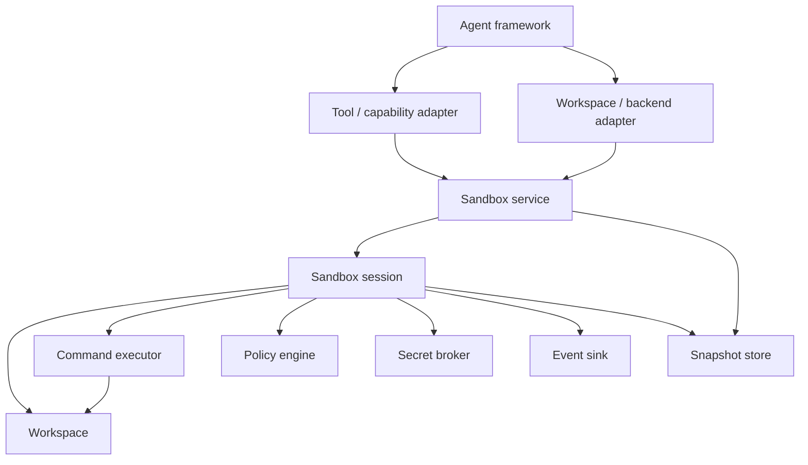

# Python Agent Sandbox High-Level Design

**Status:** Approved direction
**Scope:** Framework-neutral core, tool/capability adapters, and workspace/backend adapters
**Deferred:** MCP, remote control-plane protocols, and arbitrary-code isolation

Implementation sequencing is defined in the
[Python Agent Sandbox Implementation Plan](./PLAN.md).

## 1. Design intent

The Python Agent Sandbox is a deterministic, stateful virtual workspace for server-side
agents. It gives an agent a controlled filesystem and command environment without
allowing the agent framework to define the sandbox's domain model.

The product has two distinct responsibilities:

1. Provide a framework-neutral sandbox core with predictable state, operations, policy,
   snapshots, and events.
2. Adapt that core to agent frameworks at either the tool/capability level or the
   workspace/backend level.

The in-memory implementation is a logical sandbox. It protects the virtual workspace
through its own APIs, but it is not an operating-system isolation boundary.

## 2. Approved decisions

- Keep the core independent of OpenAI, PydanticAI, LangChain, and every other agent SDK.
- Keep the default model-visible surface centered on four operations:
  `execute`, `read_file`, `write_file`, and `apply_patch`.
- Use binary-safe internal filesystem APIs while retaining bounded text reads for models.
- Make public orchestration and I/O boundaries async-first.
- Preserve one logical owner per sandbox session.
- Serialize every public operation within a session initially for deterministic behavior.
- Give each workspace one coarse state lock; do not use object-level locks or MVCC in
  version 1.
- Implement the first command executor as a constrained interpreter with exactly
  `pwd`, `cd`, `ls`, `cat`, `echo`, `mkdir`, `touch`, and `rm`.
- Do not present the constrained interpreter as a complete POSIX shell, but make every
  registered command follow familiar POSIX/Bash syntax, operand handling, output, and
  exit-status behavior as closely as the deterministic in-memory model permits.
- Require every command-level compatibility deviation to be explicit, documented in
  command metadata, and justified by a concrete constraint such as bounded resources,
  atomic publication, unavailable virtual metadata, or the absence of host processes.
- Keep first-wave command handlers stdin-aware through explicit contracts and metadata,
  while deferring useful in-memory pipelines until the search and aggregation command
  wave exists.
- Treat unknown commands and expected command failures as structured non-zero results;
  reserve exceptions for request, syntax, timeout, cancellation, policy, and internal
  failures.
- Restrict version 1 redirection to output-only commands and implement replacement and
  append through one atomic workspace mutation. Milestone 4 applies final redirection to
  every normal command or pipeline result, including a non-zero result, while timeout,
  cancellation, infrastructure failure, invalid destinations, and resource-limit
  failures leave the target unchanged.
- Use snapshots as the explicit cross-session state-transfer mechanism.
- Express every external dependency and cross-module collaboration through a narrow
  interface owned by the consuming module boundary.
- Support two integration levels in the current design:
  - tool/capability adapters
  - workspace/backend adapters
- Treat MCP as a possible future integration point, not part of the current architecture
  or implementation phase.

## 3. Goals

- A complete sandbox can run without an LLM or agent framework installed.
- The in-memory workspace never projects the host filesystem by default.
- Commands operate on virtual state through a constrained command executor.
- All mutations have deterministic ordering and stable error behavior.
- Snapshots capture enough state to resume the workspace in another session.
- Policy, secrets, and telemetry are replaceable without being optional afterthoughts.
- Framework adapters translate contracts rather than reimplement domain behavior.
- Unsupported capabilities fail explicitly instead of silently falling back to host
  behavior.

## 4. Non-goals

- Providing a complete POSIX/Linux shell, host process model, or every POSIX utility.
  The supported command subset still targets familiar POSIX/Bash behavior to reduce
  model repair turns.
- Executing arbitrary Python safely in the application process.
- Multi-owner collaborative mutation of one session.
- Transparent access to the host filesystem, environment, processes, or network.
- Making workflow checkpoints interchangeable with sandbox snapshots.
- Defining MCP, HTTP, A2A, or another remote protocol in the current phase.
- Supporting every feature exposed by every agent framework.

## 5. Architecture



The dependency direction always points inward:

```text
agent SDK -> adapter -> sandbox service/session -> narrow component interfaces
```

The core never imports an adapter or agent SDK.

## 6. Integration levels

### 6.1 Tool/capability level

Use this level when the framework accepts typed functions, toolsets, or capabilities but
does not own a replaceable workspace abstraction.

The host creates or resumes a sandbox session. The adapter binds that session to the four
model-facing tools and translates domain results and errors into framework-specific tool
responses.

```text
model -> framework tool -> adapter -> SandboxSession operation
```

This is the universal integration and the first implementation target.

Detailed design:
[Tool/capability integration](./integrations/tool-capability/README.md).

### 6.2 Workspace/backend level

Use this level when a framework defines a backend, client/session, filesystem, or runtime
contract. The adapter implements that framework contract and delegates operations and
lifecycle to the sandbox service.

```text
framework runtime -> backend adapter -> SandboxService / SandboxSession
```

This can make framework-provided file and shell tools operate on the virtual workspace,
but only for features the adapter explicitly supports. It does not move the model or
agent loop into the in-memory workspace.

Detailed design:
[Workspace/backend integration](./integrations/workspace-backend/README.md).

## 7. Core components

| Component | Boundary ownership | Detailed design |
|---|---|---|
| Sandbox service | Session creation, lookup, resume, expiration, and deletion | [Sandbox service](./components/sandbox-service/README.md) |
| Sandbox session | Agent-facing operations, lifecycle, coordination, and composition | [Sandbox session](./components/sandbox-session/README.md) |
| Workspace | Virtual paths, files, directories, metadata, quotas, and atomic mutations | [Workspace](./components/workspace/README.md) |
| Command executor | Parsing and executing the constrained command language | [Command executor](./components/command-executor/README.md) |
| Policy admission | Minimal explicit per-operation decision seam; composed authorization deferred until a concrete trust boundary exists | [Policy admission](./components/policy-engine/README.md) |
| Secret broker | Resolving approved secret references into scoped leases | [Secret broker](./components/secret-broker/README.md) |
| Event sink | Structured operation, audit, and lifecycle event delivery | [Event sink](./components/event-sink/README.md) |
| Snapshot store | Durable or process-local storage of versioned sandbox snapshots | [Snapshot store](./components/snapshot-store/README.md) |

## 8. Public boundaries

### 8.1 Sandbox service

The service is the host-facing lifecycle boundary:

```python
class SandboxService:
    async def create(self, request: CreateSandboxRequest) -> SandboxHandle: ...
    async def get_session(
        self,
        handle: SandboxHandle,
        *,
        owner_id: str,
    ) -> SandboxSession: ...
    async def resume(self, request: ResumeSandboxRequest) -> SandboxHandle: ...
    async def delete(
        self,
        handle: SandboxHandle,
        *,
        owner_id: str,
    ) -> None: ...
```

The concrete API may evolve, but lifecycle ownership must remain separate from
model-facing tools.

### 8.2 Sandbox session

The session is the application-facing operation facade:

```python
class SandboxSession:
    async def execute(
        self,
        request: SessionExecuteRequest,
    ) -> SessionExecuteResult: ...
    async def read_file(self, request: ReadFileRequest) -> ReadFileResult: ...
    async def write_file(self, request: WriteFileRequest) -> FileMutationResult: ...
    async def apply_patch(self, request: ApplyPatchRequest) -> PatchMutationResult: ...
```

Session request/result types add operation metadata while composing the workspace and
command-executor domain contracts. Explicit `SessionExecute*` names avoid ambiguity with
the command executor's public `ExecuteRequest` and `ExecuteResult`.

The session may also expose host-only lifecycle and binary APIs required by backend
adapters:

```python
async def start(...)
async def read_bytes(...)
async def write_bytes(...)
async def stat(...)
async def list_entries(...)
async def create_snapshot(...)
async def restore_snapshot(...)
async def close(...)
```

These host APIs are not automatically model-visible.

## 9. Agent-facing tool contract

The default model-visible surface remains intentionally small:

| Tool | Required behavior |
|---|---|
| `execute` | Run a command through the constrained executor with timeout and output limits |
| `read_file` | Return a bounded, line-oriented text range with location metadata |
| `write_file` | Atomically create or replace a complete text file |
| `apply_patch` | Apply a context-aware mutation with optional optimistic concurrency |

Optional tools such as `list_files`, `file_info`, and `search_files` may be enabled by a
capability profile. Snapshot creation, restore, policy configuration, secret grants, and
session deletion remain host-controlled by default.

## 10. Component dependency rules

1. `SandboxService` constructs and owns sessions but does not implement filesystem or
   command behavior.
2. `SandboxSession` coordinates collaborators and owns operation ordering.
3. `Workspace` owns virtual filesystem semantics and never invokes the command executor.
4. `CommandExecutor` may consume a narrow workspace port; it never reaches a concrete
   workspace implementation directly.
5. Command parsing is a stateless capability owned by the command-executor boundary.
   A factory may share one immutable parser across executors, but `SandboxService` and
   `SandboxSession` do not parse or reinterpret command language.
6. The minimal policy-admission collaborator returns an explicit decision and does not
   mutate workspace state. Composed authorization remains deferred; workspace,
   command-executor, and session invariants stay authoritative in their owning modules.
7. `SecretBroker` returns scoped leases and does not persist secrets in workspace or
   snapshot state.
8. `EventSink` observes completed decisions and operations; event failures follow an
   explicit delivery policy.
9. `SnapshotStore` stores and retrieves snapshots and consumes workspace snapshot data
   as an immutable contract; it does not mutate a workspace or decide snapshot timing.
10. Adapters depend on service/session contracts only and contain no core policy.

### 10.1 Parser ownership and sharing

The current parser is implemented as stateless tokenizer and parser functions inside
`mem_sandbox.command_executor`. Each execute request is parsed independently, but no
parser state is stored per sandbox session.

Milestone 4 may wrap those pure functions in an immutable `CommandParser` dependency so
one parser instance can be shared by every compatible executor assembled by a session
factory. Sharing does not move language ownership to `SandboxService`: the service
constructs sessions and collaborators but does not parse command text, inspect syntax, or
apply command semantics.

Registry lookup, capability-profile admission, environment expansion, pipeline-safety
checks, and execution limits remain executor-owned because they can differ between
executors even when the syntax parser is shared. If a later concrete trust boundary
requires command authorization, it must consume an immutable prepared artifact exposed
by the command-executor boundary rather than duplicating parsing in the session, service,
or policy module.

## 11. Core lifecycle

### 11.1 Create and use

```text
host creates sandbox
  -> service validates options
  -> service constructs workspace and collaborators
  -> service constructs one session
  -> service starts the session
  -> adapter binds session to framework
  -> model invokes tools
  -> session authorizes, executes, and emits events
```

### 11.2 Snapshot and resume

```text
host requests snapshot
  -> session acquires a consistent state boundary
  -> workspace and session state are serialized
  -> snapshot store persists versioned bytes and metadata
  -> original session may be closed

host resumes snapshot
  -> service authorizes owner access to the reference
  -> snapshot store loads and validates snapshot
  -> service creates a new session identity
  -> factory prepares and commits restored workspace, cwd, and environment while CREATED
  -> service starts the new session
  -> adapter binds the resumed session
```

Snapshots transfer sandbox state. Framework conversation state and workflow checkpoints
remain separate concerns.

Milestone 3 records source-session provenance without enforcing owner authorization in
the session or minimal store. `SandboxService` owns authorization in the later lifecycle
composition. Restore validates a workspace-prepared immutable candidate, including the
required cwd, before publishing workspace and session state.

## 12. Session state and ownership

A session has one logical owner and a state machine:

```text
CREATED -> RUNNING -> CLOSING -> CLOSED
CREATED, RUNNING, or CLOSING -> FAILED
FAILED -> CLOSING -> CLOSED
```

Required invariants:

- A closed or failed session rejects new mutations.
- Construction produces `CREATED`; explicit `start()` is required to enter `RUNNING`.
- A closed session is never restarted. Resume creates a new session object.
- Session handles are opaque outside the core.
- Every public operation within one session is serialized in the first version.
- One end-to-end operation deadline includes gate wait, policy, collaborator execution,
  state commit, and required terminal event delivery.
- Every request defaults to a 30-second end-to-end timeout and reserves up to one second
  explicitly for required terminal delivery before mutation begins.
- Once close is requested, the active operation may finish while queued and new
  operations are rejected.
- Workspace operations are independently linearizable under one coarse state lock.
- Independent sessions may execute concurrently.
- Reads may become concurrent only after revision-consistent immutable read semantics are
  implemented without weakening observable ordering.
- Snapshot restore is exclusive with every other operation.
- Timeout or cancellation cannot leave an untracked mutation running.
- Normal execute results commit returned cwd/environment even for non-zero command exits.
- Repeated close/delete calls are idempotent where practical.
- Behavior collaborators are borrowed; the session closes one owned resource scope that
  contains only per-session closeable resources.

## 13. Data and error contracts

Core boundaries use domain types rather than dictionaries. Core-internal requests carry
explicit identity, path, limits, and optimistic concurrency information where
applicable; public live-session requests rely on the session to attach identity after
admission.

Stable error categories include:

- invalid request
- invalid or escaping path
- file or session not found
- unsupported operation or command
- stale content hash
- file, node, output, or total-size quota exceeded
- command timeout or cancellation
- policy denied
- secret denied or expired
- snapshot incompatible or corrupt
- session closed, failed, or expired

Adapters map these errors into each framework's tool or backend error shape without
changing their meaning.

## 14. Security model

The in-memory backend provides:

- path containment within the virtual workspace
- no host filesystem projection by default
- command allowlisting through the virtual executor
- explicit size and operation limits
- secret reference policy
- structured audit events

It does not provide:

- memory isolation from Python code running in the same process
- protection from direct `os`, `pathlib`, socket, or subprocess calls made outside the
  sandbox interfaces
- a multi-tenant code-execution boundary

Arbitrary or untrusted code requires a future process, container, VM, microVM, or WASM
executor behind the same command/session contracts.

## 15. Current design phase

Included:

- core component contracts
- in-memory workspace
- constrained virtual command executor
- snapshots, policy, secrets, and events
- tool/capability adapters
- workspace/backend adapters

Deferred:

- MCP
- HTTP or OpenAPI control plane
- A2A
- hosted sandbox providers
- local subprocess and container executors
- multi-owner sessions

MCP remains a possible future interoperability adapter. It must be evaluated after the
native integration boundaries are proven and must not alter the core domain model.

## 16. Documentation hierarchy

```text
docs/
  HIGH_LEVEL_DESIGN.md
  PLAN.md
  components/
    sandbox-service/
    sandbox-session/
    workspace/
    command-executor/
    policy-engine/
    secret-broker/
    event-sink/
    snapshot-store/
  integrations/
    tool-capability/
    workspace-backend/
```

Each component `README.md` owns its detailed responsibilities, interfaces, invariants,
failure semantics, and test expectations. A behavior or boundary change is incomplete
until its corresponding component document is updated.
