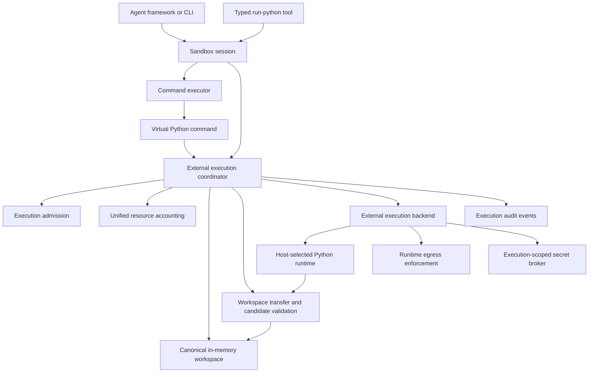

# External Execution and Python Runtime Design

**Status:** Approved roadmap direction in issue #49; not implemented

## Purpose

External execution lets an agent run a workspace Python program without executing
arbitrary code inside the MemSandbox application process.

MemSandbox remains the canonical workspace, lifecycle, policy, accounting, and event
boundary. A host-selected execution backend runs code in a separate environment and
returns a bounded candidate workspace result for validation and atomic publication.
Python is the first planned runtime, while the backend contract remains language-neutral.

## Decision summary

- Never import or execute arbitrary agent-supplied Python in the MemSandbox process.
- Add a generic external execution boundary; implement Python as its first runtime
  adapter.
- Keep execution absent from the default virtual profile.
- Distinguish trusted host subprocess execution from isolated execution in configuration,
  capability descriptions, results, and events.
- Treat a local host subprocess as a development convenience, not an untrusted-code or
  multi-tenant security boundary.
- Select runtime, image, package set, limits, workspace-transfer behavior, network grant,
  and secret grant through immutable host configuration.
- Transfer workspace state explicitly. Do not transparently mount arbitrary host paths
  or let a model select a host working directory.
- Validate a complete returned workspace candidate and publish its changes atomically.
- Preserve file changes after any normal process exit, including non-zero exit, when the
  returned candidate is valid. Timeout, cancellation, infrastructure failure, invalid
  output, or failed accounting publishes no changes.
- Route optional networking through the controlled-egress design and enforce it below
  the guest. No backend receives unrestricted egress by implication.
- Account for compute, memory, process, scratch, workspace, output, transfer, network,
  and concurrency use through the Milestone 7 resource-accounting boundary.
- Keep package installation and mutable runtime construction out of the first Python
  profile.

## Security profiles

| Profile | Intended use | Claim |
|---|---|---|
| `virtual` | Current in-memory workspace and constrained virtual commands | Logical/API boundary; no arbitrary code |
| `connected` | Virtual profile plus controlled outbound HTTP | Logical/API boundary with brokered egress |
| `trusted-host-execution` | Local development and trusted automation | Process separation only; no hostile-code containment claim |
| `isolated-execution` | Agent-generated or otherwise untrusted code | Isolation strength is defined by the selected backend and deployment |

Profiles are host-selected and immutable for a live session. Model inputs may select only
operations already granted by the profile and may narrow limits. A snapshot does not
carry authority to restore into a stronger profile.

An implementation must report the configured profile and backend isolation properties.
It must not infer that every container, subprocess, WASM runtime, VM, or hosted provider
offers equivalent containment.

## Goals

- Execute a bounded Python script stored in the virtual workspace.
- Keep the MemSandbox process, host filesystem, environment, and credentials outside the
  script's implicit authority.
- Support at least one explicitly classified external backend.
- Make workspace input and output deterministic, bounded, integrity-checked, and atomic.
- Enforce wall time, CPU, memory, process, output, scratch, workspace, transfer, and
  concurrency limits outside agent control.
- Terminate the complete execution resource tree on timeout, cancellation, session
  deletion, or backend failure.
- Keep networking disabled by default and compose with controlled egress when enabled.
- Record reproducible runtime provenance without claiming arbitrary programs are
  deterministic.
- Provide equivalent virtual-command and typed-tool adapters over the same backend.
- Preserve framework neutrality and avoid dependencies on an agent SDK in core.

## Non-goals

- Claiming that an in-process Python evaluator, AST filter, import hook, or
  `RestrictedPython` creates secure containment.
- A complete interactive terminal, shell, PTY, debugger, notebook kernel, or REPL in the
  first iteration.
- Transparently mounting arbitrary host directories or inheriting the host working
  directory.
- Inheriting the host process environment, Python path, user site-packages, credentials,
  open handles, or proxy settings.
- Model-controlled runtime images, executables, package indexes, installation commands,
  resource limits, network policy, or secret policy.
- `pip install`, native build tools, arbitrary package managers, or mutable shared
  environments in the first profile.
- GPU scheduling, distributed compute, background daemons, long-lived services, inbound
  ports, or detached processes.
- Promising deterministic output from arbitrary Python code.
- Making repository cloning a side effect of Python execution. Repository ingestion is a
  separate host-controlled workspace boundary.

## Architecture



`SandboxSession` owns operation ordering and the end-to-end deadline. The future
execution module owns an external execution coordinator plus runtime requests, backend
lifecycle, output collection, usage, provenance, and backend error translation. The
workspace owns path validation, archives, candidate restore, hashes, quotas, and atomic
publication.

No execution backend mutates the live in-memory tree directly.

## Session and command integration

The external execution coordinator is separate from the provider-specific backend. It
owns workspace export, backend invocation, candidate validation, publication,
accounting, and child events. The backend owns only its external runtime.

A future optional typed session operation delegates to the coordinator under the normal
session gate and end-to-end operation sequence. A model-facing `run_python` tool calls
that session operation rather than invoking a backend directly.

The virtual `python` command is already running inside one admitted `execute` operation.
It must not call a public session operation and reacquire the session gate. Its command
context carries the current operation identity, deadline, cancellation, accounting, and
protection state to a narrow command-owned execution port implemented by the same
coordinator.

This composition gives command and typed-tool adapters identical execution semantics
without making the command executor depend on `SandboxSession` or giving an agent SDK
direct backend authority.

## Backend boundary

Exact names remain an implementation decision. A possible framework-neutral shape is:

```python
@dataclass(frozen=True, slots=True)
class RuntimeRef:
    name: str
    version: str
    immutable_digest: str | None


@dataclass(frozen=True, slots=True, kw_only=True)
class ExecutionLimits:
    timeout_seconds: float
    max_cpu_seconds: float
    max_memory_bytes: int
    max_processes: int
    max_stdout_bytes: int
    max_stderr_bytes: int
    max_scratch_bytes: int
    max_workspace_output_bytes: int
    max_transfer_bytes: int


@dataclass(frozen=True, slots=True, kw_only=True)
class ExternalExecutionRequest:
    runtime: RuntimeRef
    entry_path: SandboxPath
    arguments: tuple[str, ...] = ()
    input_revision: Revision
    input_root_hash: ContentHash
    workspace_archive: WorkspaceArchiveData
    limits: ExecutionLimits


@dataclass(frozen=True, slots=True)
class ExecutionUsage:
    wall_time_ms: float
    cpu_time_ms: float | None
    peak_memory_bytes: int | None
    process_count: int | None
    stdout_bytes: int
    stderr_bytes: int
    scratch_bytes: int | None
    transfer_bytes: int


@dataclass(frozen=True, slots=True)
class ExternalExecutionResult:
    exit_code: int
    stdout: str
    stderr: str
    candidate_workspace: WorkspaceArchiveData
    usage: ExecutionUsage
    provenance: RuntimeProvenance


class ExternalExecutionBackend(Protocol):
    async def execute(
        self,
        request: ExternalExecutionRequest,
        context: ExecutionOperationContext,
    ) -> ExternalExecutionResult: ...
```

The backend receives an immutable workspace artifact rather than a concrete
`MemoryWorkspace`. It returns a candidate artifact rather than a host path. Domain
requests contain no untyped environment dictionary, provider client, agent SDK object,
host process handle, or raw secret.

The first Python request should execute a workspace file with bounded arguments.
Interactive stdin and `python -c` may be evaluated later. Agents can use `write_file` to
create exact script content without introducing multiline shell syntax.

## Backend classifications

### Trusted host subprocess

A local subprocess backend may be useful for learning, trusted automation, and fast
development feedback. It should still:

- create a backend-owned ephemeral working directory;
- use a sanitized explicit environment;
- avoid the host user site-packages unless the runtime definition requires them;
- bound output and wall time;
- terminate the process tree;
- validate all imported results;
- clean up after every outcome.

Those controls reduce accidents but do not contain hostile code. Depending on the host,
the child may still access files, processes, devices, credentials, sockets, kernel
interfaces, and other users' resources. This backend must be named and documented as
trusted-host execution.

### Container or managed sandbox

A container or hosted sandbox can provide resource and filesystem isolation when
correctly configured. The implementation decision must document:

- kernel sharing and escape assumptions;
- user and privilege model;
- root filesystem and capability restrictions;
- seccomp, namespace, device, and mount policy where applicable;
- network enforcement;
- runtime image provenance;
- cleanup and tenancy guarantees.

The word "container" alone is not an isolation claim.

### VM or microVM

A VM-backed provider can offer a stronger kernel boundary. Its adapter still must prove
workspace transfer, deadline, accounting, egress, credential, retention, and cleanup
semantics. Remote-provider marketing claims do not replace MemSandbox conformance.

### WASM or WASI

A capability-oriented runtime may provide a narrow execution surface with attractive
portability. Python implementation and package compatibility may be limited. A WASM
prototype should be selected only if representative workloads fit its runtime and
extension constraints.

## Python runtime profile

The first runtime definition should be immutable and host-owned:

- exact Python implementation and version;
- image, environment, or runtime digest where available;
- fixed available package set and lock digest;
- fixed entry behavior;
- deterministic locale and text encoding where the backend supports them;
- explicit environment-variable allowlist;
- network disabled unless a separate grant is compiled successfully;
- no interactive package installation.

Runtime definitions may be reused across sessions, but writable execution state is never
shared. Caches are host infrastructure and cannot contain workspace data, secrets, or
mutable package state across authorization boundaries.

Adding packages is a host deployment operation. An agent-visible `pip install` combines
untrusted code execution, arbitrary build hooks, external networking, mutable runtime
state, and supply-chain policy, and therefore requires a separate approved design.

## Workspace transfer

The initial transfer should reuse the bounded portable workspace archive and prepared
restore boundaries rather than inventing a host-directory contract.

### Input

1. Admit the operation under the session gate and capture the input revision and root
   hash.
2. Reserve worst-case execution and transfer resources.
3. Export one deterministic bounded workspace archive.
4. Transfer the archive to a newly allocated execution environment.
5. Extract it under the backend workspace root without following links or accepting
   unsupported node types.

The entry path is a `SandboxPath` proven to exist as a file in the captured workspace.
The backend never receives an arbitrary host path.

### Output

1. After normal process termination, capture a complete bounded candidate workspace.
2. Reject symbolic links, hard links, devices, sockets, path escapes, invalid names,
   duplicate normalized paths, unsupported metadata, oversized files, excessive nodes,
   and transfer overflow.
3. Decode and verify the candidate through workspace-owned archive preparation.
4. Calculate the resulting root hash and resource usage.
5. Reconfirm the expected input revision when future session concurrency permits
   overlapping mutations.
6. Atomically commit the prepared candidate.
7. Settle actual resource usage and emit the terminal event.

The current serialized session gate prevents another public operation from changing the
workspace during execution. Revision preconditions remain part of the contract so a
future concurrency change cannot introduce silent lost updates.

Copying the complete workspace is intentionally simple and correct for the first
iteration. Incremental diff transfer, RPC-backed virtual filesystems, FUSE, 9P, shared
content providers, and copy-on-write images are later optimizations justified by
measurement.

## Publication semantics

The result boundary distinguishes process outcome from backend outcome.

- Exit code zero and non-zero are both normal process completion.
- A valid candidate workspace from either normal exit may commit, matching the existing
  virtual command behavior where a command can change files before returning non-zero.
- Timeout, cancellation, forced termination, backend unavailability, malformed output,
  quota failure, resource-accounting failure, transfer failure, or required pre-commit
  audit failure publishes no candidate changes.
- Once the workspace candidate commits, the operation reports that committed outcome
  even if cancellation arrives before the caller receives the result.
- Output truncation behavior is explicit and does not change whether an otherwise valid
  candidate may commit. Infrastructure overflow that prevents safe collection is not a
  normal process result.

The implementation must test every boundary because external execution cannot roll back
files already written inside the guest; atomicity is provided when the candidate is
published back to MemSandbox.

## Network composition

External execution starts with networking disabled. If a profile grants controlled
egress:

- the network grant is host-selected and narrower than or equal to the session grant;
- the backend proves it can enforce the grant below the guest;
- DNS, redirect, destination, proxy, TLS, request, response, and cumulative controls
  follow the controlled-network design;
- all traffic is accounted and auditable;
- ambient proxy and cloud credentials are absent;
- failure to compile or enforce a requested grant prevents execution.

Passing an `OutboundHttpGateway` Python object into the guest is insufficient because
the program can use another library or raw sockets. Library helpers may improve
ergonomics but are not the enforcement boundary.

Raw package installation, Git network protocols, and arbitrary socket access remain
disabled even when a bounded HTTP tool exists unless their exact behavior is separately
approved.

## Secrets

The current execute environment overlay must not be copied automatically into external
execution. Arbitrary code can read every injected value and attempt to encode it in
files, output, resource usage, errors, or network traffic.

An execution secret design must:

- require a distinct host grant naming allowed references;
- evaluate runtime, entry path, destination access, and operation context before leasing;
- use the narrowest backend-supported injection mechanism;
- keep lease lifetime within the operation deadline;
- prevent secret persistence in returned workspace state and snapshots;
- redact output, errors, events, and backend diagnostics;
- combine secret and network policy so a granted secret cannot be sent to an unrelated
  destination;
- document limitations against hostile code and side channels.

Where possible, prefer brokered host operations that use credentials outside the guest
over revealing reusable secret material to arbitrary code.

## Unified resource accounting

Execution requires both hard backend enforcement and shared logical accounting. The
backend limit prevents one guest from exceeding its allocation. The session ledger
prevents many individually valid runs from exceeding cumulative policy.

The shared model uses different semantics for different resources:

- retained capacity for workspace or snapshot occupancy;
- cumulative consumption for CPU time and transferred bytes;
- active leases for concurrent executions and processes;
- optional rate windows for provider calls;
- hard ceilings plus observed peaks for memory and scratch use.

Unified attribution and policy do not imply one counter type or one interchangeable
credit unit.

Dimensions include:

- active and queued execution count;
- wall-clock and CPU time;
- configured and observed memory;
- process count;
- input and output workspace bytes;
- transfer bytes;
- scratch bytes;
- stdout and stderr bytes;
- network requests and transferred bytes when enabled;
- secret leases;
- provider operations and externally billed units where measurable.

Reserve maximum permitted use before provisioning expensive resources. Reject if the
reservation cannot fit. Settle measured use and release unused reservation exactly once
on success, non-zero exit, denial, timeout, cancellation, backend failure, or cleanup
failure.

Missing measurements must be represented as unavailable, not zero. A backend that cannot
enforce a required hard dimension cannot claim the profile that requires it.

Network usage nested inside an execution is attributed to both contexts without charging
the same deployment or tenant budget twice. The accounting contract must define
parent-child attribution before connected execution is enabled.

## Repository ingestion and artifact export

Repository transfer remains host-controlled and separate from the execution backend.
The host may clone or authenticate outside MemSandbox, validate a bounded content tree
or portable archive, and import it through workspace-owned restore semantics.
Repository control metadata such as `.git` is excluded from the default source import;
the initial workspace contains the checked-out content tree, not a credential-bearing
host checkout.

Execution consumes only the resulting workspace artifact. It receives no repository URL,
host checkout path, Git credential, host Git configuration, credential helper, or
remote-tracking authority by implication.

After execution, the host may export:

- a complete bounded portable archive;
- a content-hash and revision-bound workspace diff;
- explicitly selected artifacts.

A future typed VCS capability may expose repository-aware status, diff, commit, or remote
operations. It requires its own policy and credential design and should build on
controlled egress rather than invoking an unrestricted host Git process.

## Command and typed-tool adapters

The same execution service may be presented as:

- a constrained virtual `python` command for terminal-oriented agents;
- a structured `run_python` tool with an entry path, immutable arguments, and narrowed
  limits.

If the command uses the `python` name, its descriptor must state the exact supported
subset. The first profile should support a workspace script path and bounded arguments,
not claim a full host Python CLI, REPL, stdin, environment, package manager, or signal
model.

The command parser remains responsible only for command syntax and argument expansion.
It does not provision runtimes, create host paths, enforce isolation, parse Python, or
apply returned workspace changes. The command handler receives a narrow execution port.

Adapters expose the configured profile and backend classification accurately. A trusted
host backend must never be presented to the model or application as isolated execution.

## Provenance and reproducibility

Every result should record bounded host-visible provenance:

- execution identifier;
- backend kind and adapter version;
- security profile;
- Python implementation and version;
- immutable runtime or image digest when available;
- package-set or lock digest;
- input workspace revision and root hash;
- output workspace revision and root hash after commit;
- configured limits and measured usage;
- network-policy identifier when enabled.

Provenance contains no host path, provider credential, secret value, internal endpoint,
or unbounded provider metadata.

Equivalent provenance improves repeatability and incident analysis. It does not guarantee
deterministic output when code uses time, randomness, concurrency, external services, or
runtime-specific behavior.

## Events and observability

Execution events are correlated with one parent sandbox operation. Candidate bounded
facts include:

- runtime and backend identifiers;
- security profile;
- entry-path hash or sandbox-normalized path according to event policy;
- lifecycle stage;
- process exit code;
- termination reason;
- input and output workspace hashes;
- configured and measured resource values;
- network grant presence;
- publication outcome;
- cleanup outcome.

Source code, arguments containing protected data, stdout, stderr, workspace content,
host paths, raw provider errors, environment values, and secret values are excluded from
default events.

The deployment must decide whether provisioning and execution may begin when required
audit delivery is unavailable. Events remain outside the guest and cannot be modified by
the executed program.

## Lifecycle and cleanup

Execution follows one owner-managed lifecycle:

```text
admit
  -> reserve resources
  -> export workspace
  -> allocate backend
  -> transfer input
  -> start process
  -> wait or cancel
  -> terminate complete resource tree when required
  -> collect bounded result
  -> validate candidate
  -> publish or reject
  -> release backend
  -> settle resources
  -> emit terminal outcome
```

Allocation handles are opaque and never model-visible. Session close or delete requests
cancellation and waits for bounded cleanup. Detached processes and post-session backend
resources are prohibited.

Cleanup failure is explicit. It must not overwrite an already committed workspace result
or expose unsafe provider diagnostics. A backend that cannot demonstrate process-tree
termination and resource reclamation is not conforming.

## Failure model

Stable failures should distinguish:

- execution capability unavailable;
- runtime or profile unsupported;
- entry path invalid or not found;
- execution policy denied;
- resource reservation denied;
- workspace export, transfer, or candidate validation failed;
- backend unavailable or provisioning failed;
- process timeout or cancellation;
- hard CPU, memory, process, scratch, output, workspace, transfer, or network limit
  exceeded;
- process exited normally with a non-zero code;
- returned workspace conflicted with the expected revision;
- required audit failed;
- cleanup failed.

A normal non-zero exit is a structured execution result, not an infrastructure
exception. Provider SDK, process API, container runtime, hypervisor, and host filesystem
exceptions are translated at the backend adapter.

## Required tests

- Unit tests with fake backend, workspace transfer, policy, accounting, clock, event
  sink, secret broker, and egress controls.
- Profile tests proving network and execution remain absent by default and model inputs
  cannot widen authority or limits.
- Workspace round-trip tests for unchanged, created, modified, removed, binary, empty,
  and nested files.
- Rejection tests for links, devices, duplicate normalized paths, path escapes, invalid
  encodings where text is required, quotas, node limits, and corrupted archives.
- Commit-matrix tests for zero exit, non-zero exit, timeout, cancellation, output
  overflow, invalid candidate, budget failure, event failure, and cleanup failure.
- Process-tree termination and no-detached-resource tests.
- Resource reservation, settlement, missing-measurement, and cumulative-session boundary
  tests.
- Secret canaries across input, guest environment, output, returned files, snapshots,
  events, errors, provider diagnostics, and representations.
- Network-disabled and system-level controlled-egress tests for isolated backends.
- Runtime provenance and immutable package-profile tests.
- Command and typed-tool conformance against the same backend result normalization.
- Cross-platform behavior tests; backend-specific isolation tests may require controlled
  runners but cannot weaken required core conformance.

## Delivery sequence

1. Approve security-profile terminology, backend contracts, stable errors, accounting,
   and publication semantics.
2. Implement fake execution and workspace-transfer boundaries with a conformance suite.
3. Add a trusted-host subprocess adapter clearly labeled for local development, if its
   learning value justifies maintenance.
4. Select and implement one isolated backend from representative workload and threat
   evidence.
5. Add the bounded Python runtime profile with networking and package installation
   disabled.
6. Add virtual-command and typed-tool adapters.
7. Compose controlled egress only after the selected backend proves enforcement below
   the guest.

## Exit criteria

- Arbitrary agent-supplied Python never executes inside the MemSandbox process.
- The default profile exposes no Python or host execution.
- Every enabled backend reports an accurate security classification and immutable runtime
  provenance.
- Input workspace state is bounded and integrity-checked.
- Returned workspace changes publish atomically only for a valid normal process result.
- Non-zero exit, timeout, cancellation, infrastructure failure, and post-commit outcomes
  follow the documented publication matrix.
- Hard backend limits and cumulative session accounting cover every required resource
  dimension.
- The complete process/resource tree is reclaimed after every outcome.
- Networking is disabled or enforced below the guest according to the controlled-egress
  design.
- Secrets are never inherited implicitly and remain absent from persistent or
  model-visible state.
- Command and typed-tool adapters pass the same normalized conformance scenario.

## Maintenance rule

Any change to security profiles, runtime selection, workspace transfer, publication
semantics, process isolation, resource enforcement, networking, secret injection,
package behavior, provenance, events, or cleanup must update this document and the
external-execution conformance matrix in the same change.
