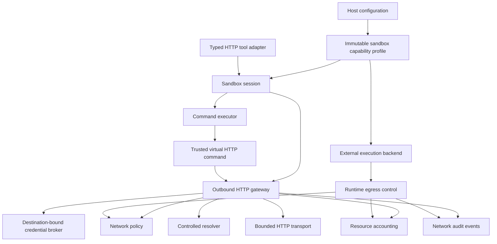

# Controlled Network Egress Design

**Status:** Selected by
[current-source verification evidence](../../product-validation/current-source-verification-evidence.md).
The Milestone 9A gateway/profile/fake seam and Milestone 9B destination-safe bounded
transport are implemented. Credentials, cumulative accounting/audit, adapters, and
full security conformance remain later slices.

## Purpose

Controlled network egress lets a host opt a sandbox into bounded outbound HTTP without
giving virtual commands, model-facing tools, or agent-supplied code unrestricted socket
authority.

The network boundary is framework-neutral. A trusted virtual command and a typed agent
tool may present different user interfaces, but both delegate to the same host-selected
gateway and policy. Network access remains absent from the default virtual profile.

## Implemented Milestone 9A and 9B boundary

`mem_sandbox.network` now provides immutable HTTP/HTTPS `GET`/`HEAD` request, response,
limit, usage, grant, context, binding, stable-error, gateway, fake, and conformance
contracts. `SandboxOptions` defaults to `VirtualSandboxProfile`; an explicit
`ConnectedSandboxProfile` supplies a requested grant. `DefaultSessionFactory` accepts a
constructor-injected host binding and rejects missing or over-ceiling connected profiles
before session publication.

`SandboxSession.send_http()` routes an approved request through the normal operation
gate, high-level policy, deadline, cancellation, event, and metadata sequence. Session
close cancels an active HTTP operation but does not close the shared gateway. Resume
uses only the current host-selected options. Snapshot state contains no grant, gateway,
policy identifier, route, or provider configuration.

The provider invocation runs in a child task wrapped by the session boundary, so
provider self-cancellation becomes a stable gateway failure and cannot forge
session-owned cancellation identity. Cancellation settlement is tracked before its
bounded wait; repeated native cancellation cannot bypass retention. A non-cooperative
gateway makes the session fail closed while its task remains retained and observed, and
cannot hold session close indefinitely.

Provider failures, including a task-raised `GeneratorExit` and nested exception groups,
become context-free `OutboundHttpGatewayFailed` values at the session boundary. During
cancellation settlement, provider-task failures remain protected secondary failures.
`GeneratorExit` delivered directly into a session-owned coroutine, plus bare
`KeyboardInterrupt` and `SystemExit`, pass through unchanged; if one escapes after
`operation.started`, the session does not manufacture a terminal event.

`BoundedOutboundHttpGateway` now composes focused policy, resolver, and one-attempt
transport ports. It strictly normalizes URL and IDNA host forms, denies a hostname
before DNS unless policy admits it, classifies every final IPv4/IPv6 address, rejects a
mixed or prohibited answer, and pins one admitted numeric peer while retaining the
original hostname for HTTP and TLS identity.

`SystemNetworkResolver` exposes the platform's final canonical hostname when available.
The static destination policy requires a changed canonical hostname to be explicitly
listed. `AsyncioHttpTransport` uses direct numeric asyncio streams, normal certificate
and hostname verification, explicit HTTP/1.1 framing, and one closed connection per
attempt. Redirects are gateway-owned and repeat the entire destination pipeline. GET and
HEAD remain unchanged across supported redirect statuses; no failure triggers address
fallback or retry.

Ambient proxies, cookies, caches, auth retries, model-selected TLS settings, credential
attachment, cumulative accounting, network-specific events, commands, and agent tools
are absent. Credential-route requests fail before policy or DNS until issue #103 adds
destination-bound leases.

## Decision summary

- Add a dedicated outbound HTTP gateway rather than letting each command construct its
  own client.
- Support HTTP and HTTPS first. Raw TCP, UDP, listening ports, WebSockets, and arbitrary
  protocols require separate designs.
- Make `GET` and `HEAD` the baseline nominally read-only method grant. They do not prove
  that a remote service has no side effects. Every other method requires explicit host
  policy, explicit retry behavior, and stronger audit treatment.
- Keep the default profile network-disabled and fail closed when no gateway or grant is
  configured.
- Select immutable network grants when the host creates a sandbox. Model input may
  narrow a granted request but cannot enable networking, choose a stronger profile, or
  increase limits.
- Re-evaluate policy at the network boundary using normalized destination and request
  facts. The session and policy modules do not duplicate URL, DNS, redirect, or protocol
  parsing.
- Resolve and attach destination-bound credentials only after request admission. Raw
  credential material never appears in model arguments, command text, workspace state,
  snapshots, events, or returned results.
- Route trusted virtual commands and typed tools through the gateway. Never implement a
  network command by falling through to a host `curl` process or shell.
- Enforce egress for arbitrary external code below the guest through its execution
  runtime, network namespace, proxy, firewall, or equivalent boundary. A Python client
  wrapper cannot contain code that can import `socket`.
- Account for requests, transferred bytes, concurrency, and time through the conditional
  Milestone 8 resource-accounting model selected for the first approved protected
  capability.

## Trust model

There are two different trust boundaries.

### Trusted in-process extensions

Virtual command and tool adapter implementations are application code and are trusted
with the capabilities explicitly injected into them. A network-capable extension
receives a narrow gateway rather than a raw HTTP client, resolver, socket factory, host
environment, or credential value.

This constrains agent input by construction. It does not protect the host from a
malicious extension package that deliberately imports networking or process APIs. The
host owns extension selection, installation, and version trust.

### Agent-supplied external code

Python or native code running in an external execution backend is untrusted when the
configured profile says so. Such code can bypass an SDK gateway by opening sockets
directly. Its outbound traffic must therefore be denied or mediated by controls outside
the guest process. The external-execution design consumes the same immutable egress
grant but enforces it through the selected runtime boundary.

The product must never describe library-level request filtering as complete egress
containment for arbitrary code.

## Goals

- Keep new sandboxes network-disabled unless the host explicitly opts in.
- Provide one bounded, auditable HTTP behavior across command and typed-tool adapters.
- Apply destination policy to every connection attempt and redirect.
- Prevent common SSRF paths, metadata access, proxy bypass, DNS rebinding, and
  credential forwarding.
- Bound request and response bytes, decompressed bytes, redirects, duration, request
  count, concurrency, and session-wide transfer.
- Bind secret use to an approved destination and operation.
- Keep provider, resolver, and HTTP-client exceptions behind stable domain errors.
- Remove provider and protected-input details from complete exception graphs and
  cancellation-settlement notes, not only displayed messages.
- Make required tests deterministic and independent of the public internet.
- Preserve the current framework-neutral core and exact default four-tool profile.

## Non-goals

- General host networking or a transparent socket API.
- Running the real `curl` executable or another host process.
- A complete curl-compatible command in the first iteration.
- Inbound ports, listeners, tunnels, port forwarding, service discovery, or peer-to-peer
  sandbox networking.
- FTP, SSH, Git protocols, mail protocols, raw database protocols, or arbitrary proxy
  protocols.
- Browser behavior, JavaScript execution, cookie persistence, or a general web crawler.
- Implicit retries of state-changing requests or claims that a failed terminal audit
  means no remote side effect occurred.
- Letting a model supply proxy configuration, TLS trust roots, client certificates,
  credential values, or policy rules.
- Treating downloaded content as trusted instructions.
- Providing a multi-tenant authorization identity inside the current process-local
  package. Applications still own caller authentication and handle authorization.

## Architecture



The network module owns URL normalization, destination classification, redirect
admission, transfer limits, and transport error translation. Command parsing remains
owned by the command executor. Session lifecycle and operation ordering remain owned by
`SandboxSession`.

## Session and command integration

The implemented optional `send_http()` session operation delegates to the gateway under
the normal session gate, deadline, high-level admission, event, and cancellation
sequence. A future model-facing HTTP tool calls that session operation rather than
bypassing session coordination.

The virtual-command path is already inside one admitted `execute` operation. Its handler
must not call a public session method and reacquire the session gate. Instead, the
command execution context carries the current session and operation identity,
cancellation, remaining deadline, resource scope, and protected-value handling to the
same gateway.

Both paths therefore use one network implementation without creating a session-command
dependency cycle or a nested public operation. The default four-tool capability remains
unchanged unless the host explicitly enables and exposes the optional typed operation.

## Capability profile

The host selects networking at sandbox creation or resume through an immutable profile.
The implemented profile contains:

- an explicit connected-profile choice rather than an enable flag in model input;
- an approved destination-policy identifier;
- allowed methods and schemes;
- immutable upper bounds;
- optional host-owned credential routes;
- event-delivery requirements.

Snapshot state does not serialize the profile, grant, credentials, internal network
topology, resolver results, proxy configuration, or provider-specific policy state.
Resume uses the destination host's current explicit options and must fit the
constructor-injected binding ceiling. The snapshot can neither restore nor widen
authority.

## Gateway contract

The implemented boundary uses immutable domain values rather than dictionaries. This
excerpt omits defaults and validation:

```python
@dataclass(frozen=True, slots=True)
class HttpHeader:
    name: str
    value: str


@dataclass(frozen=True, slots=True, kw_only=True)
class HttpTransferLimits:
    timeout_seconds: float
    max_request_header_bytes: int
    max_request_body_bytes: int
    max_response_header_bytes: int
    max_response_body_bytes: int
    max_decompressed_response_bytes: int
    max_redirects: int
    max_requests: int
    max_transferred_bytes: int


@dataclass(frozen=True, slots=True, kw_only=True)
class OutboundHttpRequest:
    method: HttpMethod
    url: str
    limits: HttpTransferLimits
    headers: tuple[HttpHeader, ...] = ()
    body: bytes = b""
    credential_route: CredentialRouteId | None = None


@dataclass(frozen=True, slots=True)
class HttpTransferUsage:
    request_count: int
    request_bytes: int
    response_bytes: int
    response_wire_bytes: int
    decompressed_response_bytes: int
    redirect_count: int
    duration_ms: float


@dataclass(frozen=True, slots=True)
class OutboundHttpResponse:
    status_code: int
    headers: tuple[HttpHeader, ...]
    body: bytes
    usage: HttpTransferUsage


class OutboundHttpGateway(Protocol):
    async def send(
        self,
        request: OutboundHttpRequest,
        context: NetworkOperationContext,
    ) -> OutboundHttpResponse: ...
```

`NetworkOperationContext` currently carries the session and operation identities, the
immutable effective grant, cancellation, and the operation deadline. Later accounting
and credential work adds focused collaborators without placing raw credential values or
host paths in the context. Its representation is non-revealing.

The gateway returns complete bounded bytes in the first iteration. Streaming,
range-based downloads, and large artifact transfer require separate contracts because
they change cancellation, accounting, partial-publication, and workspace atomicity.

## Admission and policy

Networking creates the concrete policy trigger deferred by the current policy design.
It does not justify moving every sandbox invariant into one general rule engine.

Admission has three layers:

1. `SandboxSession` admits the host-granted operation and applies its end-to-end
   deadline.
2. The network gateway performs pre-resolution admission using the normalized scheme,
   hostname, port, method, and request class. A denied hostname is never sent to DNS.
3. After controlled resolution, the gateway performs post-resolution admission over
   every resolved address immediately before connection or credential access.

Each asynchronous policy, resolver, and transport collaboration is independently raced
against the absolute gateway deadline. Its coroutine is created only after current
cancellation and deadline admission, and cancellation observed before or after either
policy phase retains the cancellation category rather than becoming a policy denial. A
collaborator that suppresses cancellation is retained and observed after timeout, but
cannot resume the pipeline, trigger a later side effect, or publish a response.

The network module should own a focused policy contract such as:

```python
class NetworkPolicyEngine(Protocol):
    async def evaluate(
        self,
        request: NetworkPolicyRequest,
    ) -> NetworkPolicyDecision: ...
```

Policy facts may include:

- session and operation identifiers;
- normalized scheme, hostname, effective port, path class, and method;
- whether the destination came from a redirect;
- redirect depth and original approved destination;
- pre-resolution hostname policy and resolved IP classifications without exposing
  resolver internals to the model;
- requested transfer limits;
- a host-configured credential-route identifier without secret material;
- already consumed operation and session resources.

The decision either denies with a stable reason or returns limits equal to or narrower
than the host grant. Evaluation failure, invalid configuration, missing facts, or an
unsupported obligation denies the request before resolver, transport, or credential
access.

No policy implementation reparses command text. The command adapter supplies a typed
HTTP request, and the gateway owns its normalization.

## Destination and transport controls

The first implementation defines and tests:

- Only `http` and `https` schemes are recognized. HTTPS should be the normal production
  default.
- URL user information and embedded credentials are rejected.
- Hostnames use one canonical comparison form. A non-ASCII label must round-trip through
  built-in IDNA from its NFC/lowercase source form; compatibility or deletion mappings
  that could collapse distinct exact-host authorities are rejected. Explicit ASCII
  A-labels remain exact authorities. Legacy numeric forms, including mixed dotted
  hexadecimal forms, over-limit raw/canonical URL representations, and control-bearing
  header values are rejected.
- Scheme, hostname, port, method, and request class pass a fail-closed pre-resolution
  policy before any DNS query, preventing arbitrary denied names from becoming a DNS
  exfiltration channel.
- IP literals are classified directly.
- A controlled resolver reports its final canonical hostname when available. Changed
  canonical hosts require explicit rule authority. Every final A and AAAA result is
  classified; a hostname is not admitted because only one of several returned addresses
  is acceptable.
- Loopback, unspecified, link-local, private, multicast, reserved, transition,
  translation, mapped, and cloud metadata destinations are denied by default for both
  IPv4 and IPv6. Explicit checks include Azure WireServer, IETF protocol-assignment and
  AS112/AMT service prefixes, IPv6 documentation space, deprecated IPv6 site-local and
  6bone space, 6to4 relay anycast, standard NAT64 ranges, 6to4, Teredo, and both ISATAP
  interface-identifier forms.
- The transport connects only to an address that was resolved and admitted for that
  request while preserving the original hostname for TLS verification.
- Redirect targets repeat URL normalization, policy evaluation, DNS validation, and
  attempt-limit enforcement. Credentials are currently unavailable rather than
  forwarded. GET and HEAD retain their method.
- The gateway performs no implicit transport retry. A future retry policy must admit,
  reserve, credential, and audit every attempt independently and must not retry a
  state-changing method without an approved idempotency contract.
- TLS certificate validation cannot be disabled by model input.
- The transport owns its TLS context, uses only system/compiled trust sources without
  ambient CA-file/directory overrides, accepts mutable or immutable Windows trust-purpose
  collections, enables strict/partial-chain verification when supported, and exposes no
  custom trust-root or client-certificate injection.
- Proxy behavior is host-controlled. Ambient `HTTP_PROXY`, `HTTPS_PROXY`, `ALL_PROXY`,
  and `NO_PROXY` values are not consumed implicitly.
- Request and response headers have count and byte limits. `response_bytes` counts
  encoded response bodies, while `response_wire_bytes` counts every consumed
  informational/final response head, encoded body byte, chunk-size line, data
  terminator, zero chunk, and trailer. The transferred-byte limit uses request-body plus
  response-wire usage across all attempts.
- Response framing uses strict decimal content lengths and hexadecimal chunk sizes;
  content-length whitespace is limited to HTTP SP/HTAB and its decimal representation
  is bounded before integer conversion. Provisional responses never cross the
  transport, gateway, grant, or session boundary as final results.
- Content encoding cannot bypass the decompressed-response limit.
- HEAD and status-defined bodyless responses do not decode representation metadata.
- Failed/cancelled attempts abort stream shutdown immediately; successful graceful
  shutdown is bounded by the same operation deadline.
- A provider-supplied cancellation value is treated as cancellation only while the
  operation's cooperative cancellation signal is active; otherwise policy, resolution,
  and transport fail closed in their own stable categories.
- No implicit cookie jar, cache, authentication retry, or connection to a model-supplied
  Unix socket exists.

Destination allowlists support exact hosts and explicit subdomain rules rather than
ambiguous suffix matching. Port, scheme, and method remain part of the rule. DNS changes
after admission cannot replace the peer because the transport receives only the
selected numeric address and opens it with `AI_NUMERICHOST`.

## Secrets and credentials

The existing secret broker deliberately deferred destination binding. Networking should
add a distinct host-owned credential route rather than encouraging agents to place
bearer tokens in command headers or environment variables.

Required ordering is:

```text
normalize request
  -> admit scheme, hostname, port, method, and request class
  -> resolve through the controlled resolver
  -> admit every resolved destination
  -> reserve network resources
  -> select an application-approved credential route
  -> lease credential material for this operation and destination
  -> attach it inside the transport boundary
  -> redact protected representations
  -> send request
  -> close the lease
```

Credential routes are configured by the host and refer to approved secret references.
Agent input may select only an explicitly exposed symbolic route, if any; it never
selects an arbitrary `SecretRef`.

The lease is bound to the current operation and approved destination. A redirect to a
different origin does not inherit it. The gateway must remove or recompute sensitive
headers before following a redirect.

Environment-based secret overlays remain appropriate only for current trusted virtual
commands that cannot communicate externally. They are not automatically forwarded into
network operations or external Python execution.

## Unified resource accounting

Network limits are both per-request and cumulative. The shared accounting boundary must
support atomic reservation before side effects and actual-usage settlement afterward.

The shared model distinguishes hard request limits, cumulative consumable usage, active
concurrency leases, and rate-window counters. It does not force those resource kinds
into one scalar balance.

At minimum, networking accounts for:

- connection/request attempts;
- request-body bytes;
- response-wire bytes;
- decompressed response bytes;
- redirects;
- active request concurrency;
- wall-clock duration;
- credential leases;
- failed and denied attempts where they consume a configured budget.

An operation-local limit does not prevent an agent from issuing many operations.
Session-wide budgets therefore remain authoritative even when each individual request is
small. A later service or tenant budget may further narrow a session budget.

Budget exhaustion is a stable resource-limit failure, not a transport error. A transport
must not start unless the required maximum reservation succeeds. Unused reservation is
released; measured usage is committed exactly once.

## Command and typed-tool adapters

The gateway supports two presentation layers:

- a structured `http_request`-style tool for agent SDKs that benefit from typed method,
  URL, header, body, and limit fields;
- a trusted virtual command for terminal-oriented tasks.

The first command should preferably use a product-specific name such as `fetch` or
`http`. If it is named `curl`, its descriptor must define and test a recognizable,
bounded compatibility subset. The initial subset must not support configuration files,
proxy flags, `file://`, arbitrary protocols, Unix sockets, client certificate paths,
netrc files, cookie jars, unrestricted output paths, or an insecure TLS switch.

The command receives only the gateway and any narrow workspace mutator needed for an
explicit bounded output-file option. The gateway itself never writes workspace files.
The command validates and atomically publishes a complete bounded response through the
workspace boundary. A failed, cancelled, timed-out, denied, or oversized transfer leaves
the target unchanged.

Adapter capability descriptions are generated from the configured profile. They must not
advertise generic internet or curl access when only bounded HTTP is available.

## Response trust and persistence

Remote content is untrusted input. A successful transport response does not make its
body safe agent instructions, trusted source code, or policy configuration.

Model-visible adapters should label network-derived content and keep it bounded. Headers
that commonly contain credentials or session state are not returned by default.
Protected-value redaction occurs before body or headers reach command output, workspace
redirection, events, errors, or model results.

Downloads written to the workspace become ordinary untrusted file bytes after passing
workspace limits and atomic mutation rules. Their source provenance may be recorded as a
bounded event or artifact record, but it must not change file identity or weaken normal
workspace reads.

## Events and observability

Network events are child resource events correlated with the parent sandbox operation.
Candidate bounded attributes include:

- policy outcome and stable reason;
- normalized scheme, hostname, and port;
- method;
- redirect depth;
- response status;
- request, encoded-response, response-wire, and decompressed byte counts;
- duration;
- budget outcome;
- credential-route identifier or secret-reference name, never its value.

Full URLs, query strings, headers, bodies, resolver exceptions, proxy configuration, and
credentials are excluded by default. Hostnames may require protected rather than
internal classification in sensitive deployments.

Required versus best-effort delivery follows the existing event policy. Audit failure
behavior must be decided before a connection starts when the deployment requires
complete egress auditing.

A required `network.request.started` event is accepted before transport access. A
terminal network event is emitted after the transport outcome. If its required delivery
fails after a request may have reached the remote service, the operation surfaces an
explicit audit-after-side-effect failure and records that the remote outcome is unknown;
it must not claim the request was not sent or retry automatically. Deployments requiring
durable audit must configure a sink whose required acceptance is itself durable.

## Failure model

Stable failures should distinguish:

- network capability unavailable;
- invalid or unsupported URL;
- destination denied;
- DNS resolution failed or produced a prohibited address;
- redirect denied or limit exceeded;
- method or request field denied;
- credential route denied, unavailable, or expired;
- request, response, decompressed, concurrency, or cumulative budget exceeded;
- connection or TLS failure;
- transport timeout or cancellation;
- response encoding invalid;
- required audit delivery failed.
- required terminal audit failed after a possible remote side effect.

Raw resolver, socket, TLS, HTTP-client, proxy, and credential-provider exceptions never
cross the boundary or appear in model-visible errors.

## Lifecycle

Provider clients, resolver infrastructure, and connection pools may be host-scoped and
shared. A sandbox receives only the immutable configured gateway view appropriate to its
profile.

Operation-specific requests, leases, reservations, and response buffers close under the
operation deadline. Session deletion cancels active requests through the existing
session lifecycle. Shared transport shutdown belongs to the service or application
resource owner, not an individual command.

## Required tests

- Unit tests with fake policy, resolver, transport, credential broker, clock, event sink,
  and resource accounting.
- Exact allow/deny boundaries for schemes, hostnames, ports, methods, IP classes, and
  redirect transitions.
- IPv4, IPv6, IP-literal, mixed-answer, canonicalization, user-information, and
  internationalized-host cases.
- Pre-resolution denial, CNAME, DNS rebinding, and admitted-address pinning tests.
- Proxy-environment isolation and TLS-verification tests.
- Request, wire-response, decompressed-response, redirect, timeout, concurrency, and
  cumulative-budget boundaries.
- Read-only versus state-changing method grants, idempotency, no-implicit-retry, and
  terminal-audit-after-side-effect behavior.
- Credential non-forwarding across origins and secret-canary coverage through output,
  files, snapshots, events, errors, and representations.
- Cancellation and cleanup at policy, resolution, credential, connect, upload, response,
  redirection, and event-delivery stages.
- Adapter conformance proving command and typed-tool paths produce the same normalized
  result and accounting.
- Required CI uses fakes or an explicitly controlled local transport and never requires
  public internet access or real credentials.

## Delivery sequence

Completed in Milestones 9A and 9B:

1. Define immutable network grants, request/result/context contracts, and stable errors.
2. Implement a fake gateway and conformance driver without a real transport.
3. Integrate explicit virtual/connected service profiles and one typed session operation.
4. Implement one bounded HTTP transport with controlled DNS/canonical-host policy,
   peer pinning, explicit redirects, ambient-proxy isolation, normal TLS verification,
   strict framing/decoding, and no implicit retry.

Remaining:

1. Add destination-bound credential routing, accounting, events, and secret-canary
   coverage.
2. Add one typed tool and one virtual command over the same gateway.
3. Complete adversarial security conformance and closure evidence.
4. Compile the same grant into an external execution backend only after its system-level
   egress enforcement is proven.

## Exit criteria

- The default sandbox performs no network calls and exposes no network capability.
- A configured command and typed tool share one gateway and normalized behavior.
- No command invokes a host shell, host `curl`, or private transport.
- Every connection and redirect is admitted using the actual normalized and resolved
  destination.
- Default policy blocks local, private, link-local, metadata, and unsupported protocol
  access.
- Credentials are destination-bound, operation-scoped, redacted, and never
  model-supplied as values.
- Per-request and session-wide resource limits are enforced atomically.
- Required audit behavior is explicit and bounded.
- Arbitrary external code cannot obtain egress unless its runtime enforces the approved
  grant below the guest.
- Cross-platform required tests are deterministic and network-independent.

## Maintenance rule

Any change to supported protocols, destination classification, DNS behavior, redirects,
proxy behavior, TLS, credential routing, transfer limits, resource accounting, network
events, or external-execution egress must update this document and its adversarial
conformance tests in the same change.
