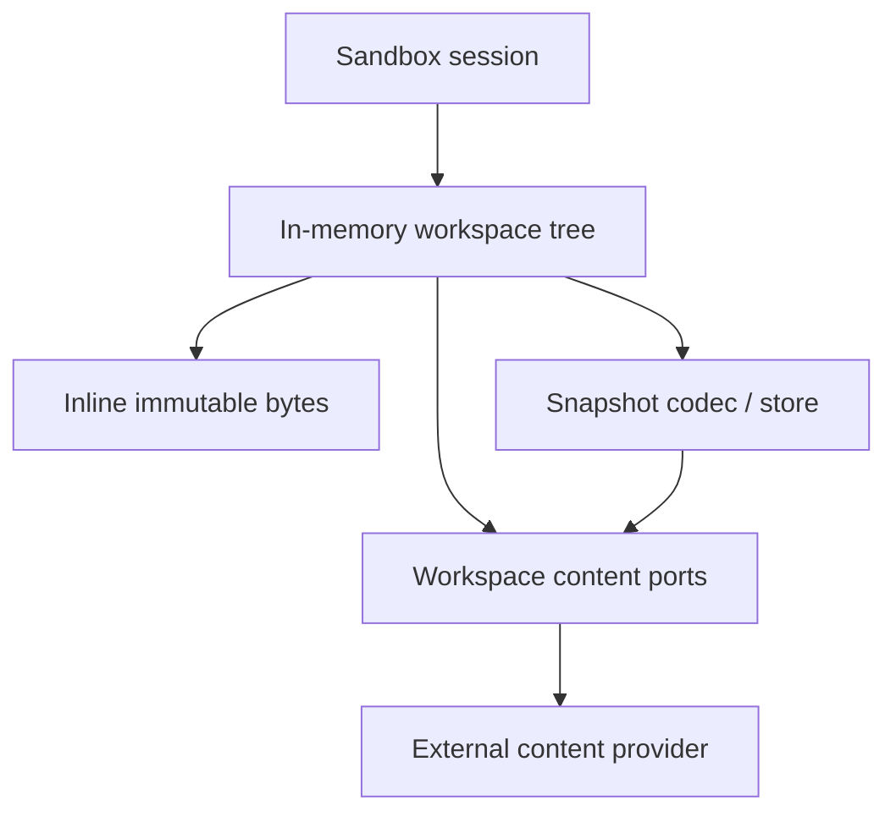

# Workspace Content Offload

**Status:** Deferred post-Milestone 5 design exploration; not approved for
implementation

The implementation plan revisits this design in Milestone 6, after native integrations
are complete and representative workspace measurements are available.

## Decision summary

MemSandbox should preserve an in-memory workspace tree while allowing file content to be
stored in an optional external content provider.

This is not a disk-backed workspace. Paths, directories, file metadata, content hashes,
quotas, revisions, and the committed workspace root remain in memory. Only immutable
file bytes may be externalized and loaded on demand.

The extension is worth retaining as a future direction because it can increase logical
workspace capacity without making new sandbox provisioning depend on copying all file
bytes into memory. It should not be implemented until the current workspace, session,
snapshot-store, and command-executor boundaries are complete and measured.

The recommended first scope is deliberately narrow:

- optimize for aggregate workspace size, not arbitrarily large individual files;
- keep every materialized file or operation under an explicit byte limit;
- keep the pure in-memory profile as the default;
- use immutable, hash-verified content references;
- do not add background eviction, streaming writes, or provider-specific behavior to the
  first iteration.

## Product alignment

MemSandbox differentiates on fast provisioning for stateful agent execution. Content
offload supports that position only if:

1. Creating an empty workspace requires no provider I/O.
2. Resuming a provider-linked workspace loads metadata first and file bytes lazily.
3. The default in-memory workspace remains dependency-free and fastest.
4. External storage placement does not change logical workspace behavior.
5. Provider failures are explicit and never cause host-filesystem fallback.

The extension must not turn MemSandbox into a remote filesystem abstraction. The
workspace remains the consistency and policy boundary; the provider is only an immutable
content dependency owned by that boundary.

## Problem statement

The current workspace stores every file as `bytes` inside the in-memory tree. Its total
workspace limit therefore also acts as a resident-memory limit. Increasing that limit
directly increases the amount of file content retained by each live sandbox.

These limits represent different concerns and should eventually be separated:

- total logical bytes represented by the workspace;
- resident file-content bytes held in process memory;
- maximum bytes materialized by one operation;
- maximum bytes returned to an agent;
- maximum encoded snapshot bytes.

For example, a future profile could permit a logical workspace much larger than 20 MiB
while still prohibiting any operation from materializing more than 20 MiB. The values are
illustrative; this document does not select new defaults.

## Goals

- Preserve fast creation of new empty workspaces.
- Preserve fast metadata-only resume for provider-linked snapshots.
- Keep the complete path tree and logical state in memory.
- Allow immutable file bytes to be inline or externally referenced.
- Keep hashes, revisions, listings, errors, and mutation outcomes independent of content
  placement.
- Bound every content materialization and provider interaction.
- Keep provider access behind workspace-owned interfaces.
- Preserve atomic workspace mutation when provider operations fail or race.
- Permit local-file, object-store, or other providers without exposing provider details
  to agents or command implementations.

## Non-goals

- Replacing `MemoryWorkspace` with a host-filesystem workspace.
- Allowing arbitrary host paths, mounts, symbolic links, or direct object-store URLs.
- Making individual files unbounded.
- Supporting streaming writes or commands in the first offload iteration.
- Making provider availability part of empty-workspace provisioning.
- Providing operating-system isolation.
- Adding transparent provider fallback or eventual workspace consistency.
- Solving metadata scaling, tree-copy cost, or whole-tree hash recomputation solely
  through content offload.

## Proposed architecture



The workspace tree remains authoritative for:

- normalized paths and node kinds;
- logical file sizes and content hashes;
- directory and root hashes;
- quotas and revision state;
- atomic publication of mutations;
- inline or external content placement metadata.

The provider owns immutable byte storage only. It does not interpret paths, enforce
workspace policy, increment revisions, calculate directory hashes, or decide when a
workspace mutation commits.

## Logical content model

A future file node should separate logical identity from physical placement:

```python
@dataclass(frozen=True, slots=True)
class ContentIdentity:
    content_hash: ContentHash
    size_bytes: int


@dataclass(frozen=True, slots=True)
class InlineContent:
    identity: ContentIdentity
    content: bytes


@dataclass(frozen=True, slots=True)
class ExternalContent:
    identity: ContentIdentity
    reference: ContentRef


type FileContent = InlineContent | ExternalContent
```

`ContentRef` is an opaque domain value. It may contain a provider identifier, namespace,
and opaque object key, but it must not contain credentials or expose a model-usable URL.

The logical identity of a file is:

```text
content hash + exact byte size
```

Inline versus external placement is not part of file identity. Moving the same bytes
between tiers therefore:

- does not change the file hash;
- does not change any directory or root hash;
- does not increment the workspace revision;
- does not produce an agent-visible mutation.

This invariant allows the same logical snapshot to be restored with different physical
placement profiles.

## Workspace-owned provider boundaries

The consuming workspace module should own focused async interfaces. A possible shape is:

```python
class WorkspaceContentReader(Protocol):
    async def read(self, request: ContentReadRequest) -> ContentReadResult: ...


class WorkspaceContentWriter(Protocol):
    async def put(self, request: ContentPutRequest) -> ExternalContent: ...
```

Requests and results should use domain types rather than dictionaries:

```python
@dataclass(frozen=True, slots=True)
class ContentReadRequest:
    reference: ContentRef
    expected: ContentIdentity
    max_bytes: int


@dataclass(frozen=True, slots=True)
class ContentReadResult:
    content: bytes
    identity: ContentIdentity


@dataclass(frozen=True, slots=True)
class ContentPutRequest:
    content: bytes
    identity: ContentIdentity
```

The first version does not require range reads. Its purpose is to support a large
aggregate workspace made of individually bounded files. Verified range reads and
streaming belong to a separate extension if real workloads require files larger than the
materialization limit.

Provider dependencies are supplied through constructor injection. When no provider is
configured, the workspace operates in the current inline-only mode.

## Provider contract requirements

Every provider must provide:

- immutable content after a successful `put`;
- idempotent publication for the same content identity;
- exact byte-size metadata;
- SHA-256 identity verification;
- bounded reads that reject requests above `max_bytes`;
- cancellation and explicit timeout behavior;
- tenant or owner isolation supplied by the host configuration;
- no partial success visible through a returned reference.

Content-addressed storage is preferred. A provider may use another internal key scheme,
but every returned reference must remain bound to the expected hash and size.
Content-addressing and deduplication must not reveal object existence, ownership, timing,
or storage reuse across tenant or owner boundaries.

The live workspace should not require provider listing or synchronous deletion. Blob
retention and garbage collection are administration concerns because content may be
referenced by multiple files, workspaces, or snapshots.

### Durability and garbage collection

A reference committed into a live workspace or valid snapshot must remain readable for
the retention period promised by the provider. Garbage collection must never delete
content reachable from:

- a committed live workspace tree;
- a valid provider-linked snapshot;
- an in-progress publication that may still commit.

Provider retention may use leases, namespace lifetime, reference manifests, or
mark-and-sweep with a grace period. The mechanism is provider-specific, but the
reachability invariant is not optional.

Read failures must distinguish transient availability failures from permanent missing or
corrupt content. A transient failure leaves the file retryable. A permanently missing
blob or hash mismatch is a hard integrity failure: reads, patches, and portable snapshot
exports fail explicitly and never omit or replace the file. The workspace retains the
logical node for inspection and recovery rather than silently mutating committed state.

## Placement policy

Placement is host-controlled and not agent-controlled. The first implementation should
use simple immutable configuration rather than a pluggable policy engine:

```text
inline-only
threshold-offload
```

`threshold-offload` stores content inline below a configured threshold and publishes
larger content through the provider. The threshold must not exceed the per-operation
materialization limit.

The first implementation should not include:

- background least-recently-used eviction;
- automatic rehydration of the complete workspace;
- adaptive thresholds;
- provider selection by path or file extension;
- multiple providers in one workspace;
- agent-visible controls for placement.

Those features add concurrency, lifecycle, and predictability costs without being
required to prove the core value.

## Operation semantics

### Provisioning

Creating a new empty workspace performs no provider calls. It creates the same empty
in-memory root as the current implementation.

Resuming a provider-linked snapshot reconstructs the in-memory tree from verified
metadata and content references. It does not download every file. Provider
compatibility is validated once, while individual content reads remain lazy.

Provider clients should be host-scoped and reusable so creating each workspace does not
establish a new remote connection.

### Write

For externally placed content:

1. Validate request shape and static limits.
2. Calculate the exact content hash and size.
3. Perform a fast, non-committing precheck of current preconditions and quotas.
4. Publish immutable content outside the workspace state lock.
5. Acquire the workspace lock.
6. Revalidate write preconditions, current quotas, and current state authoritatively.
7. Commit the new file descriptor and workspace revision atomically.

A provider failure changes no workspace state. If the workspace precondition fails after
publication, the unreferenced content is harmless and is reclaimed by provider garbage
collection. Provider deletion must not be part of the workspace commit path. The
precheck reduces obviously doomed uploads but cannot replace the final locked check.

Policy or service-level budgets must also bound aggregate published bytes and provider
calls across operations. A per-operation limit alone does not prevent repeated failed or
conflicting writes from creating unbounded provider cost.

### Read

Inline content is returned from memory. External content is loaded through the reader
port with the operation's materialization limit. The workspace verifies the returned
size and SHA-256 hash before exposing bytes.

The initial extension should require every readable file to fit within the
materialization limit. Model-facing response limits remain independently smaller when
appropriate.

There is no fallback from a failed external read to the host filesystem or another
provider.

### Patch

The first offload iteration may materialize one bounded file, apply the existing patch
logic, publish the resulting immutable content, and atomically commit the new reference.

Multi-file patching must account for the total materialized bytes and total provider
operations. Failure before the final workspace commit leaves the prior logical state
unchanged.

Patching files larger than the materialization limit remains unsupported until a
separate streaming or chunk-aware patch design exists.

### Copy, move, and remove

- Copy reuses the immutable content identity and reference; it does not copy provider
  bytes.
- Move changes only workspace metadata.
- Remove deletes only the workspace reference.
- Provider garbage collection occurs asynchronously outside the workspace mutation.

### Tier transition

Converting inline content to an external reference is a physical storage change, not a
logical file mutation. If a later version supports explicit compaction, the transition
must preserve the content identity and must not increment the workspace revision.

Background tier transitions should remain deferred until lock behavior, cancellation,
and snapshot interaction are designed and benchmarked.

## Limits and accounting

The existing `max_total_bytes` must not silently change meaning. Introducing content
offload requires explicit new limit names and a snapshot schema update.

Candidate limits are:

| Limit | Meaning |
|---|---|
| `max_logical_file_bytes` | Maximum exact size represented by one file |
| `max_logical_workspace_bytes` | Maximum sum of all logical file sizes |
| `max_resident_content_bytes` | Maximum inline or cached file bytes held by one workspace |
| `max_materialized_bytes` | Maximum content loaded by one operation |
| `max_provider_operations` | Maximum provider calls allowed by one public operation |
| `max_read_response_bytes` | Maximum bytes returned through a model-facing read |
| `max_snapshot_bytes` | Maximum encoded portable snapshot size |

Logical quota checks use the size stored in verified `ContentIdentity`, not the number of
resident bytes. A copied file counts toward logical workspace bytes exactly as it does
today, even if immutable provider content is physically deduplicated.

Commands that inspect multiple files must also enforce an aggregate scan or
materialization budget so external content cannot produce unbounded memory use, latency,
or provider cost.

## Snapshot behavior

Two explicit snapshot modes may eventually be useful.

### Portable snapshot

A portable snapshot embeds all file bytes using the current deterministic encoding
model. It can be restored without the original provider, but export must materialize
external content and remain subject to materialization and encoded-size limits.

Portable export may fail explicitly when the workspace is too large. It must never
silently produce a provider-dependent snapshot.

### Provider-linked snapshot

A provider-linked snapshot stores verified content identities and opaque references
instead of embedding every byte. Restore reconstructs metadata without downloading file
content.

The snapshot must record:

- that it is provider-linked;
- the required provider type and compatibility version;
- the owner or namespace binding without credentials;
- each content identity and opaque reference;
- the same logical workspace revision and root hash.

Restoring with a missing or incompatible provider fails before publishing the workspace.
Per-object payload integrity is checked when content is first read. The provider contract
must guarantee that references returned from committed snapshots remain valid for the
snapshot retention period.

Snapshot mode is selected by the host. Agents cannot request a weaker portability or
durability mode.

## Consistency and concurrency

The current workspace method call remains the transaction boundary.

External I/O must not be performed while holding the workspace state lock unless a
future operation cannot preserve correctness otherwise. Immutable publication before
the lock and state revalidation inside the lock preserve atomic visibility without
serializing all workspace activity behind provider latency.

The following remain invariant:

- failed provider operations do not mutate workspace state;
- failed stale-content or quota checks do not mutate workspace state;
- readers observe either the old or new content identity, never a partial transition;
- storage placement cannot affect ordering, hashes, or revisions;
- restore publishes one complete candidate tree atomically.

## Failure semantics

Future stable errors should distinguish:

- content provider unavailable;
- content reference not found;
- content size mismatch;
- content hash mismatch;
- content materialization limit exceeded;
- provider operation timeout or cancellation;
- permanent loss of previously committed content;
- incompatible provider-linked snapshot;
- portable snapshot required but too large;
- provider write failed before workspace commit.

Provider SDK exceptions must be translated at the adapter boundary. Raw provider
exceptions, credentials, bucket names, URLs, or object keys must not be exposed to
agents.

## Security and ownership

- Provider references are opaque and never model-visible.
- Credentials are host configuration and never workspace content.
- The provider adapter enforces tenant and namespace binding.
- The workspace never accepts an arbitrary URL or provider key from an agent request.
- Reads verify expected size and content hash before returning full content.
- Provider access is auditable through bounded metadata events, not raw file content.
- No provider failure may trigger direct host-filesystem or network access outside the
  configured adapter.

Content offload changes memory residency and durability; it does not strengthen
same-process isolation or make arbitrary code safe.

## Impact on the current implementation

The current implementation has four relevant assumptions:

1. `_FileNode` directly owns `content: bytes`.
2. `read_range` decodes and scans the complete file.
3. the snapshot codec embeds every file as base64;
4. each mutation deep-copies and remeasures the complete tree.

Content offload would require changing the first three assumptions. It does not solve the
fourth. Metadata-heavy workspaces may still require path-copying immutable nodes, cached
subtree hashes, and incremental counters as an independent optimization.

Before implementing offload, the command executor and session must consume focused
workspace interfaces rather than the concrete `MemoryWorkspace`. Shared conformance
tests should then run against:

- inline-only workspace content;
- threshold-offloaded content with an in-memory fake provider;
- provider-linked snapshot restore.

## Recommended delivery sequence

### Phase 0: retain the design

- Keep this document as a deferred extension.
- Complete the current session, snapshot-store, command-executor, policy, and event work.
- Add baseline provisioning, mutation, snapshot, and memory benchmarks.
- Collect real workspace size and access-pattern data.

### Phase 1: prove the boundary

- Add workspace-owned reader and writer content ports.
- Replace direct file bytes with a placement-aware immutable descriptor.
- Implement an in-memory fake provider.
- Preserve the inline-only default and all current observable semantics.
- Add conformance, atomicity, corruption, and provider-failure tests.

### Phase 2: prove lazy resume

- Add an explicit provider-linked snapshot schema.
- Restore metadata without eagerly loading content.
- Prove that root hashes and revisions match portable snapshots.
- Measure empty creation and metadata-only resume latency.

### Phase 3: add one production provider

- Select one provider based on a real deployment requirement.
- Keep provider configuration outside the core domain model.
- Add retention, ownership, retry, timeout, and observability behavior.
- Do not add multiple production providers before the first one proves the abstraction.

### Later, only with evidence

- verified range reads;
- host-only streaming writes;
- bounded read-through caching;
- explicit compaction or background eviction;
- chunked or Merkle-addressed large-file content;
- provider-aware garbage collection.

## Entry criteria for implementation

Implementation should begin only when:

- the current core lifecycle and snapshot-store milestones are complete;
- measurements show resident file bytes are a meaningful scaling constraint;
- workloads need larger aggregate workspaces while retaining bounded individual files;
- baseline provisioning latency exists to prevent regressions;
- provider retention and ownership requirements are known;
- a provider-linked snapshot is more valuable than simply raising current memory limits.

## Success criteria

The extension succeeds when:

- empty workspace provisioning remains equivalent to the inline-only baseline;
- provider-linked resume requires no file-content downloads;
- identical logical files and trees have identical hashes in every placement mode;
- storage-only tier changes do not increment revisions;
- aggregate logical capacity can exceed resident content capacity;
- each operation remains bounded by explicit materialization and provider-call limits;
- provider failures preserve prior committed workspace state;
- garbage collection cannot reclaim content reachable from a live workspace or valid
  snapshot;
- permanent content loss is surfaced as an integrity failure and never produces a
  partial read or snapshot;
- the inline-only profile remains simple, dependency-free, and fully supported.

## Open questions

These decisions should be made from measured workloads rather than in advance:

- What aggregate workspace sizes justify offload?
- What should the default materialization and offload thresholds be?
- Is portable snapshot export required for externally stored workspaces?
- Which component owns provider-linked snapshot retention and garbage collection?
- Is one provider per sandbox service sufficient?
- Do real workloads require files larger than the materialization cap?
- Are verified byte-range reads necessary before a production provider?
- Should repeated content be deduplicated per workspace, owner, or deployment?

## Maintenance rule

Future changes to content identity, placement, logical quota semantics, provider
contracts, snapshot portability, or lazy restore must update this document together with
the workspace and snapshot-store designs.
